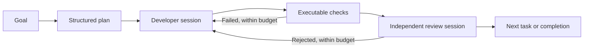

# FORJA

**A development orchestrator that turns a goal into code changes, executable checks, and an independent review.**

FORJA coordinates Claude Code and Codex through a small Node.js controller. It owns task state, validation, retry budgets, and recovery; native coding agents handle implementation and review. The aim is to improve delivered software quality per unit of context, time, and model usage.

[](package.json)
[](package.json)
[](CHANGELOG.md)
[](LICENSE)

The complete Core implementation is included here: scheduling, native executors, validation, independent review, recovery, context retrieval, metrics, and the viewer. Economy and local-model presets are optional extensions to that workflow.

## Versions

| Version | What it contains |
|---|---|
| [Core v0.1.0](https://github.com/nunomarques97/forja/tree/v0.1.0) | The Core baseline before the routing experiment: Claude/Codex adapters, executable checks, independent review, recovery, context retrieval, usage accounting, and the viewer. |
| [Core v0.2.0](https://github.com/nunomarques97/forja/tree/v0.2.0) | The same foundation plus caller-defined final checks, explicit phase/model routing, and optional economy/Ollama presets. |

Use the v0.1.0 tag to inspect the earlier implementation. This README describes the current Core; experimental presets remain disabled unless explicitly selected.

## Why this project

Long coding-agent conversations accumulate context, mix implementation with self-review, and make interrupted work difficult to reconstruct. FORJA moves coordination into code: each phase starts a fresh session, relevant context is selected from files, and progress is persisted on disk.

The current Core evolved from a larger role-based workflow. It uses a compact execution loop, with optional planning and no mandatory roster of specialist agents.

## How it works



The controller executes checks and records their output. Review runs in a separate session with read-only access. Caller-defined final acceptance checks run at integration, before approval. Authentication errors, timeouts, exhausted budgets, and invalid results leave the run blocked with its work preserved.

## Engineering decisions

| Concern | Implementation |
|---|---|
| Recoverable execution | Persisted JSON state, atomic state-file replacement, per-project locks, checkpoints, and explicit recovery commands. |
| Executor boundaries | Native CLI adapters exchange structured results; scheduling and routing remain in the controller. |
| Context management | Bounded repository maps and lexical Markdown retrieval with source paths, line references, and hashes. |
| Quality gates | Executed checks, separate review sessions, and revalidation when later changes invalidate earlier evidence. |
| Resource control | Invocation and retry limits, per-route time caps, and a persisted cloud-session budget. |
| Observability | A local viewer and usage ledger attribute work by task, phase, provider, model, and attempt. Missing measurements remain unknown. |
| Publication hygiene | Reviewed technical documentation is versioned; raw prompts, conversations, and run evidence stay in ignored local storage. A release checker inspects staged content. |

The runtime uses Node's standard library. Native CLI integration reuses existing coding tools and authentication, while making CLI compatibility, sandbox behavior, and provider availability explicit operational dependencies. Session budgets are not token or currency ceilings.

## Quick start

Requirements: **Node.js 24**, **Git**, and an installed, authenticated **Codex or Claude Code CLI**. FORJA is developed and tested on Windows; several supervision and startup helpers are Windows-specific.

```powershell
git clone https://github.com/nunomarques97/forja.git
Set-Location forja
$forja = (Resolve-Path .\bin\forja.mjs).Path

# Run from the Git root of the project you want to work on.
Set-Location 'C:\path\to\your-project'
node $forja start --provider codex --goal "Add name search, preserve existing filters, and test empty results"
```

Use `--provider claude` for Claude Code. Start from a clean working tree, or explicitly authorize existing changes with `--allow-dirty`. A run edits project files and executes commands; Core workers are instructed not to commit or publish.

```powershell
node $forja core status
node $forja core usage
node $forja core resume
```

State, logs, and results live in the project's `.forja/` directory, which should be Git-ignored. Optional `core init` adds that ignore rule and short workflow references to `AGENTS.md` and `CLAUDE.md`; review and commit those setup changes before starting a run that requires a clean tree.

`node $forja serve` starts the local viewer; its `/core` page shows tasks, sessions, checks, and usage. The legacy `runner` workflow remains available for existing projects. Active legacy runs are not automatically migrated.

## Testing

The v0.2.0 public validation run contained **782 tests: 780 passed, zero failed, and two skipped** because private historical evidence was unavailable. Coverage includes scheduler transitions, recovery, provider contracts, routing budgets, usage accounting, and viewer behavior.

| Area | Examples covered | Tests |
|---|---|---|
| Scheduler and recovery | Failed checks, rejected reviews, interrupted work, exhausted budgets, and changes that invalidate earlier validation. | [Core](test/core.test.mjs) |
| Context and accounting | Knowledge selection, required-source validation, provider-specific token normalization, and incomplete usage records. | [Knowledge](test/knowledge.test.mjs), [metrics](test/metrics.test.mjs) |
| Provider routing | Local/cloud boundaries, model selection, preflight failures, and cloud-session limits. | [Routing](test/routing.test.mjs) |
| Viewer and supervision | Event reduction, API behavior, process ownership, stale locks, and recovery coordination. | [State](test/state.test.mjs), [Core observation](test/core-observe.test.mjs), [guard](test/guard.test.mjs) |
| Publication controls | Staged-content scanning and narrowly scoped synthetic-fixture approvals. | [Release checks](test/release-check.test.mjs) |

From the FORJA repository:

```powershell
npm test -- --test-concurrency=1
npm run check
npm run release:check
```

The automated suite uses temporary repositories, fixtures, and simulated model executors. It exercises orchestration without consuming model quota. Native executor smoke tests and product-task evaluations are separate from this test count.

## Current scope and limitations

Core is the recommended workflow for new FORJA runs. Passing its tests does not establish the quality of every generated product: acceptance coverage, native executor behavior, and independent review still matter.

The economy and Ollama presets are **opt-in experiments**. A medium UI trial reached its development timeout, and post-run evaluation found defects in the preserved partial output. A local Ollama smoke test demonstrated basic editing and check execution only. Existing native model defaults remain unchanged; equivalent quality at lower cost or similar completion time has not yet been demonstrated. See the [validation results and limitations](docs/ROUTING.md#validation-status).

## Explore the code

- [Scheduler and recovery](lib/core/engine.mjs) — task transitions, execution budgets, validation, and persisted state.
- [Provider adapters](lib/core/providers.mjs) and [routing](lib/core/routing.mjs) — native execution and phase/model selection.
- [Context assembly](lib/core/context.mjs), [knowledge retrieval](lib/core/knowledge.mjs), and [usage accounting](lib/core/metrics.mjs).
- [Core regression tests](test/core.test.mjs) and [routing tests](test/routing.test.mjs).

## Documentation

- [Execution contract](docs/CORE.md)
- [Routing, acceptance checks, and experimental presets](docs/ROUTING.md)
- [Research and design trade-offs](docs/RESEARCH.md)
- [Release and privacy policy](docs/RELEASE.md)
- [Complete Core runbook — Portuguese](docs/CORE-RUNBOOK.md)
- [Changelog](CHANGELOG.md)

## License

[MIT](LICENSE) · Copyright (c) 2026 Nuno Marques.
