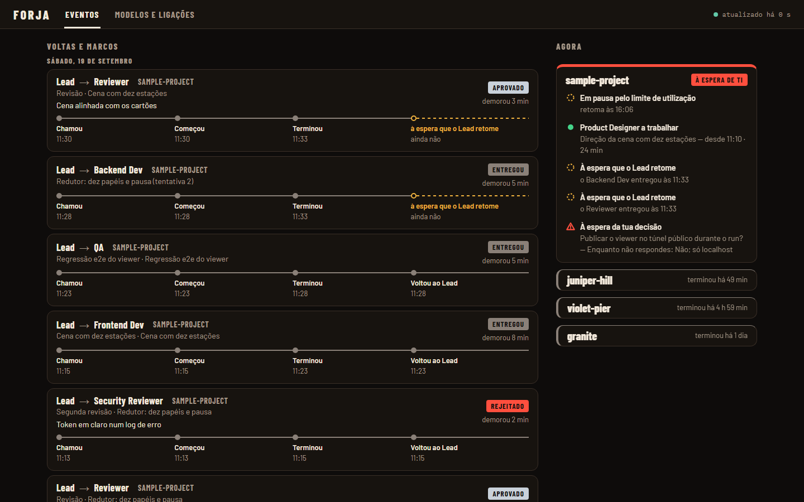
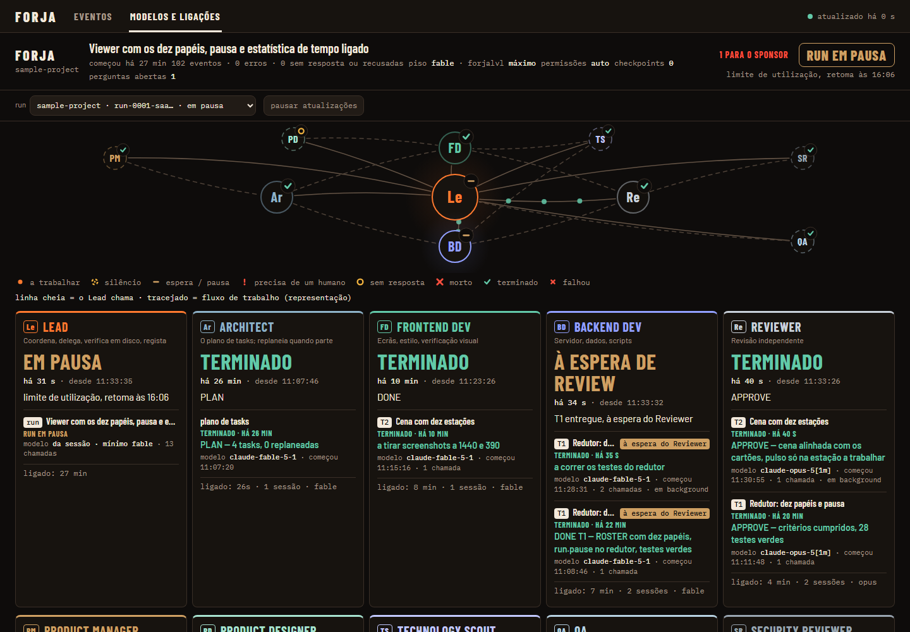
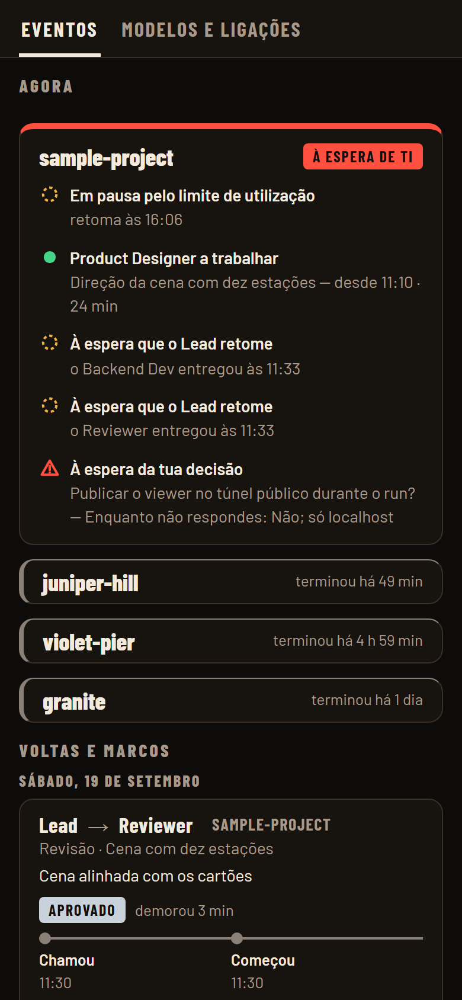
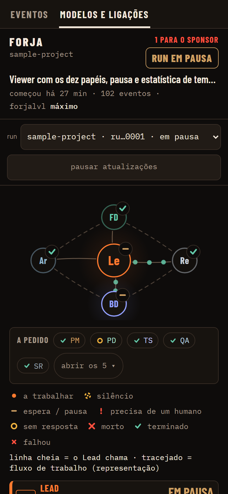

# Forja

**Forja turns Claude Code into a small software team that works on its own, and lets you watch it from your desk or your phone.**

   

You give it one goal for a project ("add a contacts page", "finish the export feature"). Forja plans the work as small tasks and hands each one to a specialist agent. An independent reviewer checks every task before it counts as done. The run keeps going through usage limits, crashes and reboots until the goal is delivered or something really needs a human. You follow along in a live dashboard, and your phone only gets a notification when it matters.



## Why it exists

One long Claude Code conversation is a poor way to build something real:

- the context fills up and gets compacted, and the agent forgets what it decided;
- the only reviewer of the agent's work is the agent itself;
- closing the terminal kills the job;
- a person has to sit there and copy prompts between a "product owner" and a "developer".

Forja replaces that with a process. It has separate roles with a model chosen per role, written hand-offs, state kept in files on disk instead of in a conversation, and a reviewer that is allowed to say no.

## What you see

The dashboard is a zero-dependency Node server that streams live updates to a static page over Server-Sent Events. It has two views.

**Events** (shown above) is the landing view and covers every project Forja manages. Each delegation shows who called whom, on which task, how far it got and the reviewer's verdict (approved, rejected, delivered). Between the delegations come the milestones: a question for the human, a block, a report delivered. The **Now** column says what each project is doing, what it is waiting for, and what comes next in its plan.

**Models and links** shows one run in detail. The crew is drawn as a graph around the Lead, followed by one card per role with its state, current task, model and time spent.



The phone gets its own layout, reached through a Cloudflare quick tunnel. From the phone you can answer the agents' questions and start a new run.

<p>
  
  &nbsp;&nbsp;
  
</p>

<sub>The screenshots above come from the real server replaying the repository's test fixtures, so the project names are placeholders. The interface is in Portuguese (see [Status](#status)).</sub>

## How it works

```
forja runner --goal "…"
  └─ plan session      Product Manager (profile, framing) → Technology Scout (stack inventory)
                       → Architect (TASKS.json)
  └─ one session per task, in order:
        Lead delegates to Frontend Dev or Backend Dev
        → Reviewer: APPROVE → (Security Reviewer, if triggered) → done, commit, checkpoint
                    REJECT  → the same Dev fixes it; after 3 attempts the task is marked
                              failed with its evidence and the run moves on
        (Product Designer / Technology Scout step in first when a trigger fires)
  └─ close session     QA → findings become tasks, or PASS → Product Manager's run report
```

A **runner** drives the project one phase at a time. For each phase (the plan, each task, the close) it starts a fresh `claude -p` session and rebuilds that session's context from files in the project's `docs/forja/` folder:

- the plan (`TASKS.json`);
- the run state (`RUN.json`);
- a handover note;
- the decisions log;
- every hand-back and verdict, in `docs/forja/reports/`.

Inside each session a **Lead** delegates to specialist subagents and always names the model explicitly. A Claude Code **hook** appends every event to `data/events.jsonl`, and the dashboard is built from that stream. A separate **guard** process relaunches a runner that died in the middle of a run. The dashboard and the guard supervise each other.

- **State lives on disk, not in a conversation.** Each session is rebuilt from files, so a compaction, a reboot or a crash loses nothing. Only one runner can work on a project at a time.
- **Usage limits are expected, not failures.** The runner waits for the reset time and resumes on its own.
- **Only real decisions reach the human.** Questions are queued with a safe default already applied, so the run never stops to wait for an answer. Spending money, creating accounts, publishing, pushing and deleting data always wait for the human, whatever the autonomy level.
- **Liveness comes from evidence.** The dashboard decides whether an agent is alive from the age of its last event, never from "saw a start, no stop yet".

## Engineering highlights

- **No dependencies at all.** The CLI, runner, guard, hook and dashboard server use only Node's standard library (HTTP, SSE, crypto, child processes, file locks). The UI is plain HTML, CSS and SVG, with no framework and no build step.
- **Event-sourced dashboard.** A pure reducer turns the append-only event log into the dashboard state. Replaying the log rebuilds any past moment, and the test fixtures are recorded event streams.
- **Crash-safe coordination.** Runs are claimed through a per-project mutex (exclusive file create with an owner token, and takeover of stale locks by rename). State files are written as temp file plus rename, so a concurrent reader never sees half a file. A runner counts as alive only when three things agree: its PID, its command line and a recent heartbeat.
- **Self-healing processes.** The dashboard and the guard watch each other under the same rules: a grace period after start-up, 3 attempts spaced 15 minutes apart, and a counter that resets only after 30 minutes of observed health. A stop file always wins, so "stopped" means stopped.
- **Model policy in one place.** Which model each role runs on depends on task complexity, the retry number and the project's level. It is written in exactly one file (`lib/models.mjs`), and `npm run check` fails if a second copy appears anywhere in the repo. A reviewer never runs on a weaker model than the developer whose work it judges.
- **A small security surface.** The viewer token is checked in constant time and kept in an HttpOnly cookie. Hosts are allow-listed against DNS rebinding. The hook never blocks Claude Code and caps payload sizes. Notifications carry status only, never code, paths or tokens.
- **Tested.** About 500 tests run offline in `npm test`: the pipeline fixtures, the reducer, the SSE transport, the CLI, the runner (against a fake `claude` binary), bootstrap and supervision. `npm run check` guards the repository's invariants.

## Run it

Requirements: **Node 24+**, **Claude Code** installed and signed in (`claude` on your PATH), and Git. There is nothing to `npm install`. Forja was developed and used on Windows 11. The core (CLI, hook, runner, viewer) is plain Node, but the auto-start, tunnel and process-supervision helpers assume Windows.

```bash
git clone https://github.com/nunomarques97/forja.git
cd forja
npm test                                  # ~500 tests, no network
node tools/serve-fixture.mjs all-roles    # the dashboard, full of realistic activity, on a local URL
```

`serve-fixture` replays a recorded run through the real server, so you can explore the dashboard without running any agent. To serve your own event log instead, run `node bin/forja.mjs serve` (http://127.0.0.1:4317/). The first visit asks for a token, which is generated on first start in `data/viewer-token.txt` (git-ignored).

To put Forja on one of your own repositories and start a run that needs no one watching:

```bash
node bin/forja.mjs bootstrap /path/to/your-repo --dry-run   # shows what it would write
node bin/forja.mjs bootstrap /path/to/your-repo             # installs the crew, skills and hook
cd /path/to/your-repo
node /path/to/forja/bin/forja.mjs runner --goal "Add a contacts page with a form that posts to /contact"
```

`bootstrap` copies the ten role definitions (`.claude/agents/`), their shared skills (`.claude/skills/forja-*`), the event hook and a `CLAUDE.md` block into the target repo. Run `runner` without `--goal` to resume the run in progress. `examples/sample-project/` is a small app that was built this way, with its full run history in `docs/forja/`.

### Optional: phone access and notifications

| Variable | What it does | Default |
|---|---|---|
| `FORJA_NTFY_TOPIC` | [ntfy](https://ntfy.sh) topic that receives status notifications (run started, a question for you, paused at a usage limit, run finished). Treat the topic name as a secret. | unset: no notifications |
| `FORJA_NTFY_SERVER` | ntfy server | `https://ntfy.sh` |
| `PORT` | dashboard port | `4317` |
| `FORJA_DATA_DIR` | where events, logs, locks and the viewer token live | `./data` |

`node bin/forja.mjs up` starts the dashboard and a Cloudflare quick tunnel so the phone can reach it, then sends the address to the phone. It expects the `cloudflared` binary in `tools/cloudflared/` (git-ignored; download it from Cloudflare's releases). `up --no-tunnel` skips the tunnel. `forja autostart install` registers the dashboard and the guard to start at login (Windows).

## The crew

Ten roles with plain names. The five **core** roles take part in every run. The five **on-demand** roles stay idle until a fixed trigger rule wakes them (full table in [docs/ARCHITECTURE.md](docs/ARCHITECTURE.md) §2b).

| Role | Kind | What it does |
|---|---|---|
| **Lead** | core | Runs the plan task by task: delegates, checks the result on disk, sends it to review, records the outcome, writes checkpoints and the handover. Never decides product, technology or visual direction, and never reviews its own work. |
| **Architect** | core | Splits the goal once into small tasks, each with a definition of done, an order, dependencies and an owner. When the plan breaks, re-plans only the tasks still to do. Never writes code. |
| **Frontend Dev** | core | Screens, styling, client logic. Builds only inside an approved `DESIGN.md` and checks every change with real screenshots at 1440 and 390 px. |
| **Backend Dev** | core | Server, data, scripts, CLIs: everything that is not UI. |
| **Reviewer** | core | Independent gate for every task. Reads the code, runs the tests, looks at the screenshots, and answers `APPROVE` or `REJECT`. Never edits code. |
| **Product Manager** | on demand | Writes the product profile at the start and makes the product decisions nobody else may make. Queues the questions only the human can answer, with a safe default already applied, and writes the run report. |
| **Product Designer** | on demand | Steps in when a task touches a screen that no design covers yet. Produces three genuinely different directions as static mocks with screenshots, picks one in writing, and writes the `DESIGN.md` contract. |
| **Technology Scout** | on demand | Steps in when a task needs a capability the stack lacks. Compares the real options within a time limit and records a binding decision in `docs/forja/TECHNOLOGY.md`. No Dev adds a technology without one. |
| **QA** | on demand | Steps in when a milestone closes: end-to-end flows on the running product, full regression and a visual pass. Each `QA FAIL` finding becomes a new task. |
| **Security Reviewer** | on demand | A second gate after `APPROVE` for anything that touches auth, secrets, network exposure, new dependencies or execution of external input. |

## Repository map

| Path | What is there |
|---|---|
| `bin/forja.mjs` | the CLI (`node bin/forja.mjs help` lists every command) |
| `lib/` | runner, guard, mutual supervision, run ownership, bootstrap, model policy, notifications, state files |
| `hooks/log-event.mjs` | the Claude Code hook: appends every event to `data/events.jsonl`, never blocks, always exits 0 |
| `viewer/` | the dashboard: server, state reducer, events feed, desktop and phone pages |
| `.claude/agents/`, `.claude/skills/` | the crew definitions and their shared methods, the same ones `bootstrap` installs elsewhere |
| `test/`, `tools/check.mjs` | the test suite, recorded event fixtures and the repository invariants |
| `examples/sample-project/` | a small app built end to end by Forja runs, with its plan, reports and decisions |
| `docs/` | [ARCHITECTURE.md](docs/ARCHITECTURE.md) (the design and source of truth, with an English summary on top), [design/DESIGN.md](docs/design/DESIGN.md) (the UI contract), [FORJA-POC-LOG.md](docs/FORJA-POC-LOG.md) (the build log: every decision, rejection and incident) |

## Status

Forja is a working personal tool, not a product. It was built in a few intense days in September 2026 and is used every day on real projects. Every task of Forja itself went through the same Reviewer gate it imposes, and the build log records the rejections as well as the approvals. Expect rough edges outside Windows.

Most design documents, UI labels and logs are in **Portuguese**, the project's working language. Code, comments and role names are in English. "Sponsor" in the docs is the human who owns the goal.

Screenshots and logs taken against the author's private projects were removed or anonymised for this public release. Project names such as `juniper-hill`, `violet-pier` or `granite` in logs and fixtures are placeholders.

## License

MIT, see [LICENSE](LICENSE).
