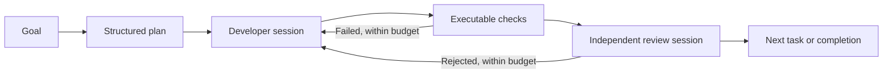

# FORJA

**A development orchestrator that turns a goal into code changes, executable checks, and an independent review.**

FORJA coordinates Claude Code and Codex through a small Node.js controller. It owns task state, validation, retry budgets, and recovery; native coding agents handle implementation and review. The aim is to improve delivered software quality per unit of context, time, and model usage.

[](package.json)
[](package.json)
[](CHANGELOG.md)
[](LICENSE)

The complete Core implementation is included here: scheduling, native executors, validation, independent review, recovery, context retrieval, metrics, and the viewer. Economy and local-model presets are optional extensions to that workflow.

## Versions

**Current release: [v0.8.0](https://github.com/nunomarques97/forja/tree/v0.8.0).**

| Version | What it contains |
|---|---|
| [Core v0.1.0](https://github.com/nunomarques97/forja/tree/v0.1.0) | The Core baseline before the routing experiment: Claude/Codex adapters, executable checks, independent review, recovery, context retrieval, usage accounting, and the viewer. |
| [Core v0.2.0](https://github.com/nunomarques97/forja/tree/v0.2.0) | The same foundation plus caller-defined final checks, explicit phase/model routing, and optional economy/Ollama presets. |
| [Core v0.3.0](https://github.com/nunomarques97/forja/tree/v0.3.0) | Explicit task boundaries, incremental provider-event diagnostics, and state preservation when atomic replacement fails. |
| [Core v0.4.0](https://github.com/nunomarques97/forja/tree/v0.4.0) | Conditional technology comparison and explicit Sponsor decisions for reported paid or unknown-cost alternatives, with a paused scheduler and authenticated decision panel. |
| [Core v0.4.1](https://github.com/nunomarques97/forja/tree/v0.4.1) | Correct resumption after a recorded Sponsor technology choice, without redundant reassessment. |
| [Core v0.4.2](https://github.com/nunomarques97/forja/tree/v0.4.2) | Validation stops if a check changes project source, preserving the files and invalidating its claimed pass. |
| [Core v0.4.3](https://github.com/nunomarques97/forja/tree/v0.4.3) | An exact overlap between task checks and caller acceptance checks runs once, preserving both ordered sequences. |
| [Core v0.5.0](https://github.com/nunomarques97/forja/tree/v0.5.0) | Explicit implementation handoff to controller validation, followed by independent review. |
| [Core v0.5.1](https://github.com/nunomarques97/forja/tree/v0.5.1) | Documentation refresh for release discovery and validation handoff. |
| [Core v0.6.0](https://github.com/nunomarques97/forja/tree/v0.6.0) | On-demand `core diagnose` summarizes existing execution metadata without calling a model. |
| [Core v0.7.0](https://github.com/nunomarques97/forja/tree/v0.7.0) | Optional `protectedFiles` pins caller-owned acceptance tests, fixtures and contracts; changes block further execution instead of silently replacing the acceptance baseline. |
| [Core v0.8.0](https://github.com/nunomarques97/forja/tree/v0.8.0) | Optional full access for every Codex and Claude phase, while retaining controller quality and Sponsor decision gates. |

Find the current version in [package.json](package.json), the complete release history in the [changelog](CHANGELOG.md), and published snapshots under [tags](https://github.com/nunomarques97/forja/tags). The table above highlights behavior changes; documentation-only patches are recorded in the changelog. Experimental presets remain disabled unless explicitly selected.

## Why this project

Long coding-agent conversations accumulate context, mix implementation with self-review, and make interrupted work difficult to reconstruct. FORJA moves coordination into code: each phase starts a fresh session, relevant context is selected from files, and progress is persisted on disk.

The current Core evolved from a larger role-based workflow. It uses a compact execution loop, with optional planning and no mandatory roster of specialist agents.

## How it works



The controller executes checks and records their output. Review runs in a separate session with read-only access by default. Full-access configurations allow additional probes in external scratch space while the reviewer must preserve project files. Caller-defined final acceptance checks run at integration, before approval. Authentication errors, timeouts, exhausted budgets, and invalid results leave the run blocked with its work preserved.

After implementation and focused tests, a developer can return `ready_for_validation`, identifying the scheduled checks left for the controller. This avoids requiring the worker to wait for those commands before handing over. It is not completion: mandatory checks and independent approval still apply. Required visual, security or other evidence outside the scheduled commands remains the worker's responsibility. Existing `done` results continue through the same checks and review.

Workers receive the current acceptance boundary, remaining task criteria, and whether integration checks apply now. Cohesive tasks avoid unnecessary development/review sessions when the work fits the configured limits; task grouping remains explicit. Incremental event journals retain bounded metadata during provider execution, including timeouts. Their timestamps measure event receipt, including CLI buffering, and do not replace missing token usage.

Material unresolved technology choices are compared inside the existing planner; routine work uses the accepted stack without a mandatory Scout session. Any reported paid or unknown-cost alternative pauses work for an explicit Sponsor choice, even when the recommendation is free. The authenticated `/core` panel presents alternatives without preselection and can resume after the final answer. A configured ntfy transport attempts a status-only notification. Cost discovery depends on model output and sources; the controller enforces reported decisions. A choice never authorizes payment, and research can add time within existing limits.

## Engineering decisions

| Concern | Implementation |
|---|---|
| Recoverable execution | Persisted JSON state, atomic state-file replacement, per-project locks, checkpoints, and explicit recovery commands. |
| Executor boundaries | Native CLI adapters exchange structured results; scheduling and routing remain in the controller. |
| Context management | Bounded repository maps and lexical Markdown retrieval with source paths, line references, and hashes. |
| Quality gates | Executed checks, separate review sessions, and revalidation when later changes invalidate earlier evidence. |
| Resource control | Invocation and retry limits, per-route time caps, and a persisted cloud-session budget. |
| Cost decisions | Persisted paid/unknown-cost choices, explicit Sponsor answers, idempotent submission, and no automatic answer through recovery or timeout. |
| Observability | A local viewer and usage ledger attribute work by task, phase, provider, model, and attempt. Missing measurements remain unknown. |
| Publication hygiene | Reviewed technical documentation is versioned; raw prompts, conversations, and run evidence stay in ignored local storage. A release checker inspects staged content. |

The runtime uses Node's standard library. Native CLI integration reuses existing coding tools and authentication, while making CLI compatibility, sandbox behavior, and provider availability explicit operational dependencies. Session budgets are not token or currency ceilings.

## Quick start

Requirements: **Node.js 24**, **Git**, and an installed, authenticated **Codex or Claude Code CLI**. FORJA is developed and tested on Windows; several supervision and startup helpers are Windows-specific.

```powershell
git clone https://github.com/nunomarques97/forja.git
Set-Location forja
$forja = (Resolve-Path .\bin\forja.mjs).Path

# Run from the Git root of the project you want to work on.
Set-Location 'C:\path\to\your-project'
node $forja start --provider codex --goal "Add name search, preserve existing filters, and test empty results"
```

Use `--provider claude` for Claude Code. Start from a clean working tree, or explicitly authorize existing changes with `--allow-dirty`. A run edits project files and executes commands; Core workers are instructed not to commit or publish.

For full access in **planning, development and review**, pass `--config C:\path\to\forja\config\core-full-access.json`. This profile enables both Codex and Claude without changing models or budgets. To retain an existing routing profile, merge `"fullAccess": true` into each native provider's entry under `providers` instead.

Codex uses `danger-full-access` and disables approval prompts. Claude uses `bypassPermissions`, disables its command sandbox for the session and exposes the default built-in tools. Operating-system privileges, managed policies, authentication and available integrations still apply. Controller validation, protected files, review integrity and Sponsor cost decisions remain enforced. The option applies to new Core runs; it does not change existing runs or the legacy runner. See the [configuration details](docs/CORE-RUNBOOK.md#acesso-completo-dos-executores).

Use `protectedFiles` to declare acceptance files whose initial bytes must be preserved, for example `{"protectedFiles":["test/acceptance.test.mjs","test/fixtures/expected.json"]}`. Include relevant helpers and data explicitly. This boundary check preserves altered files for inspection; it does not infer dependencies or certify test coverage.

```powershell
node $forja core status
node $forja core usage
node $forja core resume
```

State, logs, and results live in the project's `.forja/` directory, which should be Git-ignored. Optional `core init` adds that ignore rule and short workflow references to `AGENTS.md` and `CLAUDE.md`; review and commit those setup changes before starting a run that requires a clean tree.

`node $forja serve` starts the local viewer; its `/core` page shows tasks, sessions, checks, and usage, and accepts pending Sponsor technology choices. The CLI equivalent is `core decide --run <run-id> --decision D1 --option <option-id>`, followed by `core resume`. The legacy `runner` workflow remains available for existing projects. Active legacy runs are not automatically migrated.

## Testing

The v0.8.0 public validation run contained **855 tests: 853 passed, zero failed, and two skipped** because private historical evidence was unavailable. Coverage includes scheduler transitions, recovery, provider contracts, routing budgets, usage accounting, protected acceptance files, full-access configuration and viewer behavior. These checks validate the orchestrator, not general improvements in generated-product quality or execution time.

| Area | Examples covered | Tests |
|---|---|---|
| Scheduler and recovery | Failed checks, rejected reviews, interrupted work, exhausted budgets, and changes that invalidate earlier validation. | [Core](test/core.test.mjs) |
| Validation handoff and integrity | Explicit delivery before scheduled checks, failure/attempt limits, interrupted validation, independent approval and source preservation. | [Handoff](test/validation-handoff.test.mjs), [check integrity](test/check-integrity.test.mjs) |
| Context and accounting | Knowledge selection, required-source validation, provider-specific token normalization, and incomplete usage records. | [Knowledge](test/knowledge.test.mjs), [metrics](test/metrics.test.mjs) |
| Provider routing | Local/cloud boundaries, model selection, preflight failures, and cloud-session limits. | [Routing](test/routing.test.mjs) |
| Full access | Native permissions across all phases, preserved defaults, mixed-provider isolation and unchanged review/protected-file gates. | [Access](test/full-access.test.mjs) |
| Protected acceptance files | Pinned bytes, invalid paths, mutations during workers/checks, final regression and recovery. | [Protected files](test/protected-files.test.mjs) |
| Technology decisions | Paid/unknown-cost pauses, free alternatives, late discovery, stale answers, authentication, state bounds, notification failure and preserved budgets. | [Technology](test/technology.test.mjs) |
| Interruption diagnostics and state | Incremental metadata capture, timeout preservation, trace collisions, observation failures, and atomic replacement failures. | [Provider traces](test/provider-trace.test.mjs), [atomic state](test/state-atomic.test.mjs) |
| Viewer and supervision | Event reduction, API behavior, process ownership, stale locks, and recovery coordination. | [State](test/state.test.mjs), [Core observation](test/core-observe.test.mjs), [guard](test/guard.test.mjs) |
| Publication controls | Staged-content scanning and narrowly scoped synthetic-fixture approvals. | [Release checks](test/release-check.test.mjs) |

From the FORJA repository:

```powershell
npm test -- --test-concurrency=1
npm run check
npm run release:check
```

The automated suite uses temporary repositories, fixtures, and simulated model executors. It exercises orchestration without consuming model quota. Native executor smoke tests and product-task evaluations are separate from this test count.

## Current scope and limitations

Core is the recommended workflow for new FORJA runs. Passing its tests does not establish the quality of every generated product: acceptance coverage, native executor behavior, and independent review still matter.

The economy and Ollama presets are **opt-in experiments**. A medium UI trial reached its development timeout, and post-run evaluation found defects in the preserved partial output. A local Ollama smoke test demonstrated basic editing and check execution only. Existing native model defaults remain unchanged; equivalent quality at lower cost or similar completion time has not yet been demonstrated. See the [validation results and limitations](docs/ROUTING.md#validation-status).

## Explore the code

- [Scheduler and recovery](lib/core/engine.mjs) — task transitions, execution budgets, validation, and persisted state.
- [Provider adapters](lib/core/providers.mjs) and [routing](lib/core/routing.mjs) — native execution and phase/model selection.
- [Context assembly](lib/core/context.mjs), [knowledge retrieval](lib/core/knowledge.mjs), and [usage accounting](lib/core/metrics.mjs).
- [Core regression tests](test/core.test.mjs) and [routing tests](test/routing.test.mjs).

## Documentation

- [Execution contract](docs/CORE.md)
- [Routing, acceptance checks, and experimental presets](docs/ROUTING.md)
- [Research and design trade-offs](docs/RESEARCH.md)
- [Release and privacy policy](docs/RELEASE.md)
- [Complete Core runbook — Portuguese](docs/CORE-RUNBOOK.md)
- [Changelog](CHANGELOG.md)

## License

[MIT](LICENSE) · Copyright (c) 2026 Nuno Marques.
