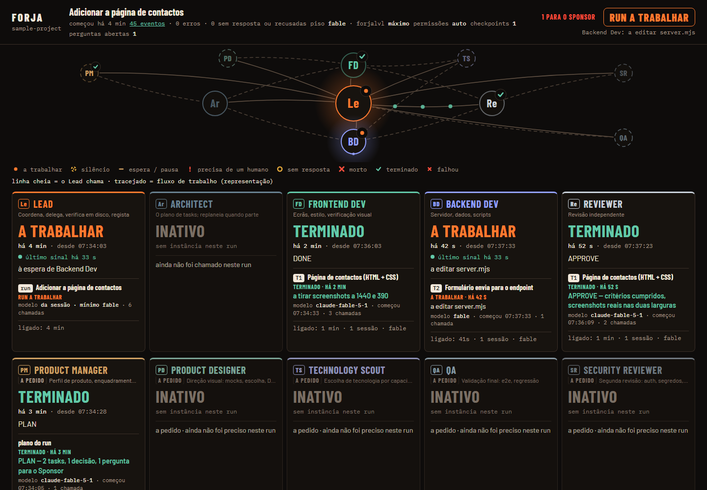
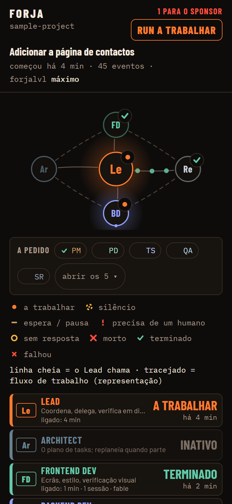

# Forja

**Forja turns Claude Code into a small software team that runs on its own, and lets you watch it work from your desk or your phone.**

You give it one goal for a project ("add a contacts page", "finish the export feature"). Forja plans the work into small tasks, hands each task to a specialist agent, has every task checked by an independent reviewer before it counts as done, and keeps going, across usage limits, crashes and reboots, until the goal is delivered or something genuinely needs a human. You follow along in a live dashboard and get a phone notification only when it matters.

**The problem it solves.** A single long Claude Code conversation is a poor way to build something real: the context fills up and gets compacted, nobody reviews the agent's work but the agent itself, a closed terminal kills the job, and a person has to sit there copying prompts between "product owner" and "developer". Forja replaces that with a process: separate roles, separate models per role, written hand-offs, state kept on disk instead of in a conversation, and a reviewer with the authority to say no.

**How it works, in one paragraph.** A *runner* (`forja runner`) drives the project one phase at a time, starting a fresh `claude -p` session for each phase (plan, one task, close) and rebuilding its context from files in the project's `docs/forja/` folder: the plan (`TASKS.json`), the run state (`RUN.json`), a handover note, the decisions log, and every hand-back and verdict written to `docs/forja/reports/`. In each session a *Lead* delegates to specialist subagents (Architect, Frontend Dev, Backend Dev, Reviewer, and five on-demand roles), always with an explicit model. A Claude Code hook appends every event to `data/events.jsonl`, and a zero-dependency Node server turns that stream into a live dashboard (SSE) for desktop and phone. A separate *guard* process relaunches a runner that died mid-run, and the dashboard and the guard supervise each other.



## Run it

Requirements: **Node 24+**, **Claude Code** installed and signed in (`claude` on your PATH), Git. No `npm install`: there are no dependencies. Developed and used on Windows 11; the core (CLI, hook, runner, viewer) is plain Node, while the auto-start, tunnel and process-supervision helpers assume Windows.

```bash
git clone <this repository> forja
cd forja
npm test                        # the whole suite, ~500 tests, no network
node bin/forja.mjs serve        # the dashboard on http://127.0.0.1:4317/
```

The first visit asks for a token; it is generated on first start in `data/viewer-token.txt` (git-ignored). To see the dashboard full of realistic activity without running anything, replay a test fixture through the real server: `node tools/serve-fixture.mjs all-roles` prints a local URL.

To put Forja on one of your own repositories and start an unattended run:

```bash
node bin/forja.mjs bootstrap /path/to/your-repo --dry-run   # shows what it would write
node bin/forja.mjs bootstrap /path/to/your-repo             # installs the crew, skills and hook
cd /path/to/your-repo
node /path/to/forja/bin/forja.mjs runner --goal "Add a contacts page with a form that posts to /contact"
```

`bootstrap` copies the ten role definitions (`.claude/agents/`), their shared skills (`.claude/skills/forja-*`), the event hook and a `CLAUDE.md` block into the target repo. Run `runner` without `--goal` to resume the run in progress. `examples/sample-project/` is a small app that was built this way, with its full run history in `docs/forja/`.

### Optional: phone access and notifications

| Variable | What it does | Default |
|---|---|---|
| `FORJA_NTFY_TOPIC` | [ntfy](https://ntfy.sh) topic that receives status notifications (run started, question for you, paused at a usage limit, run finished). Treat the topic name as a secret. | unset = no notifications are sent |
| `FORJA_NTFY_SERVER` | ntfy server | `https://ntfy.sh` |
| `PORT` | dashboard port | `4317` |
| `FORJA_DATA_DIR` | where events, logs, locks and the viewer token live | `./data` |

`node bin/forja.mjs up` starts the dashboard plus a Cloudflare quick tunnel, so the phone can reach it, and notifies the phone with the address. It expects the `cloudflared` binary in `tools/cloudflared/` (git-ignored; download it from Cloudflare's releases). `up --no-tunnel` skips the tunnel. `forja autostart install` registers the dashboard and the guard to start at login (Windows). Notifications carry status only: never code, diffs, paths or tokens, and the link never carries the viewer token.

## The crew

Ten roles with plain names. The five **core** roles take part in every run. The five **on-demand** roles stay idle until a deterministic trigger fires (full table in [docs/ARCHITECTURE.md](docs/ARCHITECTURE.md) §2b).

| Role | Kind | What it does |
|---|---|---|
| **Lead** | core | Runs the plan task by task: delegates, checks the result on disk, sends it to review, records the outcome, writes checkpoints and the handover. Never decides product, technology or visual direction; never reviews its own work. |
| **Architect** | core | Decomposes the goal once into small tasks with a definition of done, order, dependencies and owner; re-plans only the tasks still to do when the plan breaks. Never writes code. |
| **Frontend Dev** | core | Screens, styling, client logic. Builds only inside an approved `DESIGN.md` and verifies every change with real screenshots at 1440 and 390 px. |
| **Backend Dev** | core | Server, data, scripts, CLIs: anything that is not UI. |
| **Reviewer** | core | Independent gate for every task. Reads, runs the tests, looks at the screenshots, and answers `APPROVE` or `REJECT`. Never edits code, and never runs on a weaker model than the implementer. |
| **Product Manager** | on demand | Writes the product profile at the start, makes the product calls nobody else may make, queues questions only the human can answer (with a safe default already applied), and writes the run report. |
| **Product Designer** | on demand | When a task touches a screen and no design covers it: three genuinely different directions as static mocks with screenshots, a written choice, and the `DESIGN.md` contract. |
| **Technology Scout** | on demand | When a task needs a capability the stack lacks: a time-boxed comparison of real options and a binding decision in `docs/forja/TECHNOLOGY.md`. No Dev adds a technology without one. |
| **QA** | on demand | At milestone close: end-to-end flows on the running product, full regression, a visual pass. `QA FAIL` findings become new tasks. |
| **Security Reviewer** | on demand | A second gate after `APPROVE` for anything touching auth, secrets, network exposure, new dependencies or execution of external input. |

Which model each role gets (and how that shifts with task complexity, retry number and the project's "forjalvl" level) is written in exactly one place, `lib/models.mjs`; `npm run check` fails if a second copy of the policy appears anywhere in the repo.

## The run lifecycle

```
forja runner --goal "…"
  └─ plan session      Product Manager (profile, framing) → Technology Scout (stack inventory)
                       → Architect (TASKS.json)
  └─ one session per task, in order:
        Lead delegates to Frontend Dev or Backend Dev
        → Reviewer: APPROVE → (Security Reviewer, if triggered) → done, commit, checkpoint
                    REJECT  → same Dev fixes it; at most 3 attempts, then the task is
                              marked failed with its evidence and the run moves on
        (Product Designer / Technology Scout wake up first when a trigger fires)
  └─ close session     QA → findings become tasks, or PASS → Product Manager's run report
```

- **State lives on disk, not in a conversation.** Every session is rebuilt from `docs/forja/`, so a compaction, a reboot or a crash loses nothing. There is one runner per project (a lock in `data/runner/`).
- **Usage limits are expected, not failures.** The runner waits for the reset time and resumes on its own.
- **Only real decisions reach the human.** Questions go to `docs/forja/SPONSOR-QUEUE.md` with a default already applied, so the run never blocks waiting for an answer. Spending money, accounts, publishing, pushing and deleting data always wait for the human, at any autonomy level.
- **Liveness comes from evidence.** The dashboard judges "alive" from the age of the last event, never from "saw a start, no stop yet".



## Repository map

| Path | What is there |
|---|---|
| `bin/forja.mjs` | the CLI (`node bin/forja.mjs help` lists every command) |
| `lib/` | runner, guard, mutual supervision, bootstrap, model policy, notifications, state files |
| `hooks/log-event.mjs` | the Claude Code hook: appends every event to `data/events.jsonl`, never blocks, always exits 0 |
| `viewer/` | the dashboard: server, state reducer, desktop and phone pages (SVG + CSS, no framework, no build step) |
| `.claude/agents/`, `.claude/skills/` | the crew definitions and their shared methods, the same ones `bootstrap` installs elsewhere |
| `test/`, `tools/check.mjs` | the test suite, event fixtures and repo invariants |
| `examples/sample-project/` | a small app built end to end by Forja runs, with its plan, reports and decisions |
| `docs/` | [ARCHITECTURE.md](docs/ARCHITECTURE.md) (the design, source of truth; English summary on top), [design/DESIGN.md](docs/design/DESIGN.md) (the UI contract), [FORJA-POC-LOG.md](docs/FORJA-POC-LOG.md) (the build log: every decision, rejection and incident) |

Most design documents, UI labels and logs are in **Portuguese**, the working language of the project; code, comments and role names are in English. "Sponsor" throughout the docs is the role of the human who owns the goal.

## Status

A working personal tool, not a product: built in a few intense days in September 2026 and used daily on real projects. Every task of Forja itself went through the same Reviewer gate it imposes; the build log shows the rejections as well as the approvals. Expect Windows-first edges and Portuguese documentation.

Screenshots and logs taken against the author's private projects were removed or anonymised for this public release. Project names such as `juniper-hill`, `violet-pier` or `granite` in logs and fixtures are placeholders.

## License

MIT, see [LICENSE](LICENSE).
