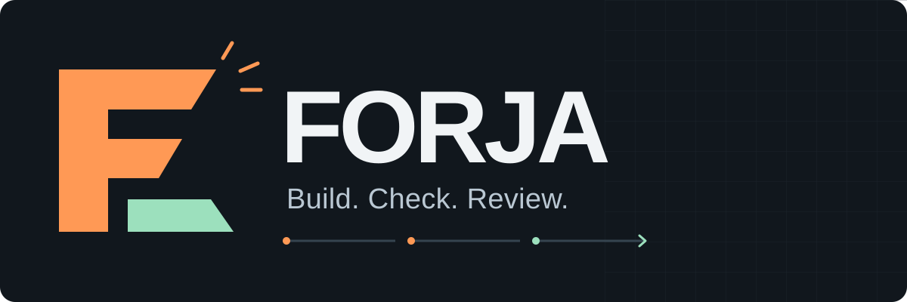
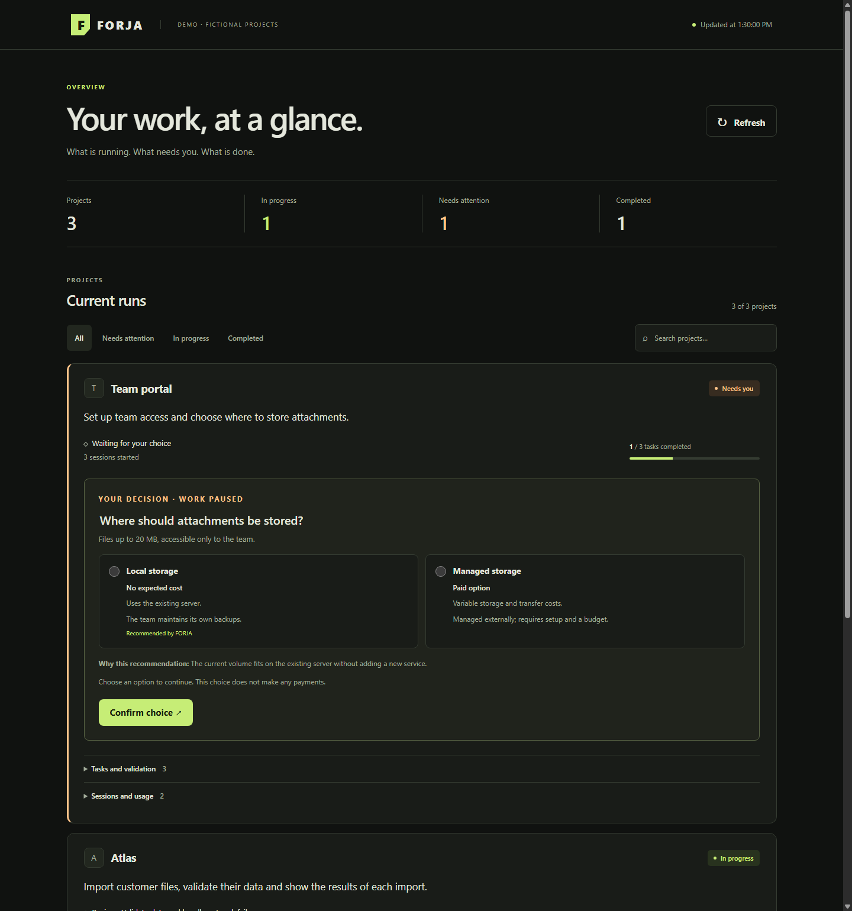
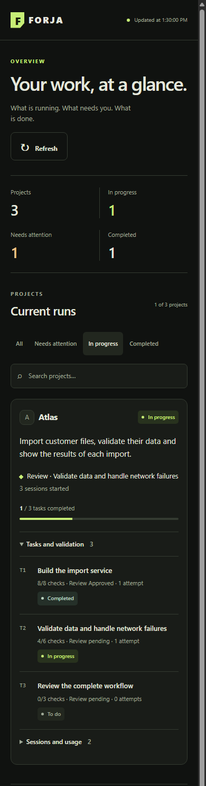
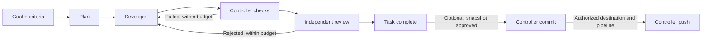
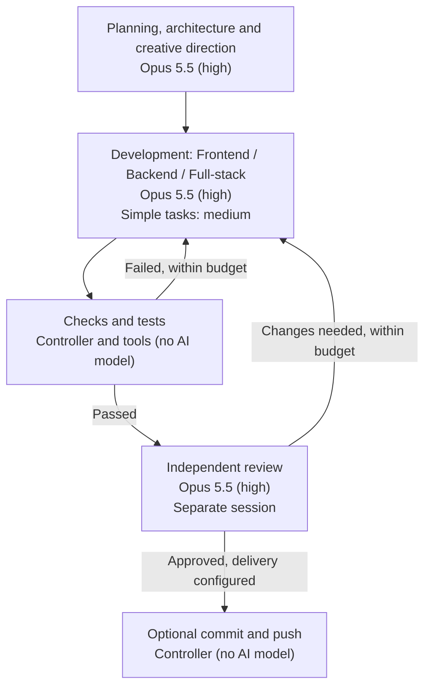

<p align="center">
  
</p>

<h1 align="center">Software work, with evidence.</h1>

<p align="center">Turn a goal into code changes, executable checks, and a separate review.<br>Claude Code and Codex do the engineering. FORJA keeps the work moving and the evidence on disk.</p>

<p align="center">
  <a href="https://github.com/nunomarques97/forja/releases/tag/v0.19.0"></a>
  <a href="package.json"></a>
  <a href="package.json"></a>
  <a href="LICENSE"></a>
</p>

<p align="center"><a href="#quick-start">Quick start</a> · <a href="#viewer">Viewer</a> · <a href="#how-it-works">Workflow</a> · <a href="#quality-and-control">Quality</a> · <a href="#troubleshooting">Troubleshooting</a> · <a href="#status-and-evidence">Status</a> · <a href="#releases">Releases</a> · <a href="#documentation">Docs</a></p>

FORJA is a **Node.js orchestration CLI** for development in an existing Git project. Each phase starts a fresh native coding-agent session with relevant context; a small controller owns task state, checks, retry limits and recovery.

- **A checkable result.** Implementation passes through executed checks and independent review before a task can finish.
- **Work survives interruptions.** State, changes and logs remain available when a run stops. Recovery is explicit and bounded.
- **Your tools and decisions.** Use Claude Code, Codex or explicit mixed routes. Reported paid or unknown-cost choices pause for the Sponsor.

The aim is high-quality delivered software. More agents and fewer tokens are possible means, not success criteria.

## Quick start

You need **Node.js 24**, **Git**, and an installed, authenticated **Claude Code or Codex CLI**. FORJA is developed on Windows; some supervision helpers are Windows-specific.

```powershell
git clone https://github.com/nunomarques97/forja.git
Set-Location forja
$forja = (Resolve-Path .\bin\forja.mjs).Path

# Work from the Git root of the project you want to change.
Set-Location 'C:\path\to\your-project'
node $forja core doctor --provider codex
node $forja start --provider codex --goal "Add name search, preserve existing filters, and test empty results"
```

Use `--provider claude` for Claude Code; it is also the default when `--provider` is omitted. The project must have a clean working tree unless you explicitly pass `--allow-dirty`. Ignore the project's `.forja/` directory: it contains private run state and logs. Optional `core init` adds the ignore rule and short instruction references; review and commit those setup changes before a clean-tree start. In a project that was prepared for the legacy crew, `core init` also migrates it: see [Core runbook](docs/CORE-RUNBOOK.md#migrar-um-projeto-legado).

`core doctor` checks local prerequisites without model calls or project changes. It does not confirm login, model access or subscription quota.

`start` stays in the foreground until the run finishes or stops, and exits nonzero unless it completed. To follow it, open a second terminal in the same project (set `$forja` there too):

```powershell
node $forja core status   # run status, tasks, limits, plan_warnings and a recovery reason when stopped
node $forja serve         # local viewer at http://127.0.0.1:4317/
```

On first use, `serve` creates an access token in `data/viewer-token.txt` inside the FORJA checkout (or in `FORJA_DATA_DIR` when set); paste it on the viewer's entry page. Use `--port` or the `PORT` environment variable to change the port. If the run stops, see [Troubleshooting](#troubleshooting).

Workers edit files and execute commands. They are instructed not to commit or publish. With explicit `delivery` configuration, the final reviewer also approves the exact release snapshot in its existing session; the controller performs authorized commit/push operations. Without it, FORJA does not commit or publish. Starting an ordinary chat does not automatically start FORJA.

## Viewer

An English workspace for the current run of each registered project: goals, progress, decisions that need you, and expandable task and session evidence. Open it with `node $forja serve` from the FORJA checkout. Project-authored text keeps its original language; the optional legacy views remain in Portuguese. Projects without a Core run appear in a discovery notice with a direct link to the legacy viewer.

**Desktop — compare alternatives and make an explicit choice.**



<details>
<summary><strong>Mobile — filter current work and inspect tasks</strong></summary>

<p></p>

</details>

Screenshots use fictional projects and illustrative measurements. They show the same responsive workspace, with the mobile view filtered to work in progress.

## How it works



Supply `--plan plan.json` to skip planning. For each task, the developer implements and runs focused tests, then hands scheduled validation to the controller with `ready_for_validation`. That handoff is not completion: the required checks must pass and a separate reviewer must approve. The controller repeats the loop for remaining tasks and revalidates when later changes invalidate earlier evidence.

**The controller owns completion.** Source-changing checks, unauthorized review edits, invalid results, timeouts and exhausted limits leave the run blocked with work preserved. An impressive partial implementation is not a successful run.

## Quality and control

For optional Linux/WSL controller isolation, use `checkIsolation` with bubblewrap and Python 3 already installed. Checks use read-only source, isolated network/process namespaces and disposable scratch; there is no host fallback. For automatic Git delivery, configure `delivery` and an explicit deployment contract per project. Unknown effects or production without authorization block push. See [configuration and limitations](docs/CONTROLLER-DELIVERY.md). The existing final reviewer owns approval; Git requires no additional agent or model invocation.


For file-only Claude workers, use `config/core-restricted-claude.json` with `--provider claude` (Claude Code 2.1.280+). Workers have no shell; the controller executes checks. See [access boundaries and limitations](docs/ROUTING.md#restricted-claude-file-tools). This option does not change existing runs or models.

Blocked runs show a safe recovery reason and execution limits in the viewer. Inspect preserved work before using `core resume` or `core retry`; checks and independent review remain required. Total sessions, cloud sessions and per-call time limits are separate budgets. Claude context stopping uses observed request input; Codex/custom do not expose an equivalent live context measurement. These limits do not change provider quota.

| What you control | What FORJA enforces |
|---|---|
| **Acceptance** | Caller-defined `finalChecks` run at integration, before approval. Required failures cannot be waived by a review. |
| **Protected contracts** | `protectedFiles` pins declared tests, fixtures and contracts. Changed, missing or linked files block further execution at checked boundaries. |
| **Independent review** | A separate session inspects source, criteria and evidence. Review must preserve project files. |
| **Paid choices** | Reported paid or unknown-cost alternatives require an explicit Sponsor selection, even when a free alternative is recommended. A selection does not authorize payment. |
| **Execution access** | Native defaults remain available; opt into full access for **both providers and all phases** with `config/core-full-access.json`. |
| **Delivery** | Optional commit/push is bound to the final reviewer’s exact snapshot; production permission is independent. No extra model call. |
| **Models and budgets** | Explicit phase/tier routes, invocation limits, cloud-session limits and per-invocation deadlines. Started failures still consume session allowance. |

Example acceptance configuration, passed through `--config acceptance.json`:

```json
{
  "protectedFiles": ["test/acceptance.test.mjs", "test/fixtures/expected.json"],
  "finalChecks": [{ "command": "node", "args": ["--test", "test/acceptance.test.mjs"] }]
}
```

Create those files before starting. Declare their relevant helpers and fixture data too: FORJA does not infer all dependencies. Hash checks protect declared bytes at execution boundaries; they do not provide continuous isolation or prove test quality. UI acceptance still needs actual browser/visual evidence. Cost discovery depends on what the worker reports and the sources it consults.

Full access is explicit:

```powershell
node $forja start --provider claude --config C:\path\to\forja\config\core-full-access.json --goal "Implement the feature and its acceptance tests"
```

The same profile supports `--provider codex`. It removes the native sandbox/approval restrictions configured by FORJA, including during planning and review, without changing models or budgets. Merge its provider settings into an existing profile to retain your routes. OS privileges, managed policies, authentication and available tools still apply. Existing runs and the legacy runner are unchanged. [Details](docs/CORE-RUNBOOK.md#acesso-completo-dos-executores).

### Providers and models

| Provider | Default model selection | Customization |
|---|---|---|
| Claude Code | `sonnet` for fast/normal tiers; `opus` for strong/critical tiers | Explicit model and effort per route. |
| Codex | Inherits the installed CLI's model/effort when unspecified | Pin model and effort for repeatable runs. |
| Custom executor | Caller-supplied executable using the result contract | Adapter-defined behavior and permissions. |

Hard work, architecture/security signals and implementation retries select stronger tiers; security-sensitive review selects `critical`. These are routing signals, not calibrated difficulty estimates. See [routing and presets](docs/ROUTING.md) before selecting experimental economy or Ollama configurations. A session limit is not a token or currency ceiling.

### Selected Claude profile

This diagram shows an **explicit, opt-in Claude profile**. Configure its model and effort routes for each new run; installing or updating FORJA does not apply this profile automatically. The built-in Claude defaults still use Sonnet for fast/normal tiers and Opus for strong/critical tiers.



`high` and `medium` are effort levels. Design, frontend, backend and security are [specialist methods](docs/CORE-SPECIALISTS.md) loaded when relevant within these phases; they do not require a permanent team or extra model sessions. Implementation retries and security/architecture risks use `high` in this profile. Fable is not part of it. See the [routing configuration](docs/CORE-RUNBOOK.md) to set explicit model IDs and effort.

## Know what happened

```powershell
node $forja core status
node $forja core usage
node $forja core diagnose
node $forja core resume
```

`diagnose` summarizes existing execution metadata without calling a model or resuming work. Missing or incomplete measurements stay explicit. `resume` continues eligible preserved work; it does not resolve a Sponsor decision or erase exhausted limits.

Since **0.8.2**, a recorded valid developer handoff can survive controller death without another development session. Recovery checks source and Git HEAD, then runs the required checks and review. Source changes after the last approval also require fresh validation and review before an unfinished run can complete. Unchanged approved source needs no extra review. These are process-crash guarantees, not power-loss durability or exactly-once external execution. [Recovery details](docs/CORE-RUNBOOK.md).

Run `node $forja serve` from the FORJA checkout to open the local viewer. The responsive workspace at `/` (also `/core` and `/m`) prioritizes projects needing attention, with search, status filters and expandable task/session evidence. It accepts pending Sponsor choices; the previous event/roster pages are available through a secondary compatibility link. A configured notification transport can alert the Sponsor. See the [runbook](docs/CORE-RUNBOOK.md) for project/run selection, notification setup and recovery.

## Troubleshooting

Start with `node $forja core status`. When a run stops, its `recovery` field (also shown in the viewer) gives a fixed reason code, guidance and the current limits. Work on disk is preserved: inspect the diff before choosing an action. Recovery commands can only raise budgets; `retry` and `abandon` require `--why`.

| `recovery.code` | What to do |
|---|---|
| `context`, `rotations` | A task reached the context limit or used its continuation budget. Inspect the checkpoint, then `core resume --max-rotations N` continues in a fresh session. |
| `no_progress_between_rotations` | Consecutive context-limit sessions changed no source and no progress notes. Split the task: `core abandon --why "..."`, then start a run with narrower tasks. Resume only with a larger `--max-context-tokens`. |
| `repeated_context_limit` | Three consecutive sessions hit the context limit without a handoff. Inspect the work, then narrow the task or explicitly raise its context budget. |
| `attempts`, `sessions`, `cloud_sessions`, `timeout` | Raise the matching limit (`--max-attempts`, `--max-sessions`, `--max-cloud-sessions`, `--max-minutes`) with `core resume` or `core retry --task T1 --why "..."`. If the implementation is already complete, `core retry --task T1 --validate-only --why "..."` goes straight to checks and review. |
| `provider`, `provider_limit` | Authentication, availability or quota failed. Fix it in the provider CLI, then `core resume`. FORJA does not retry or switch providers automatically, and larger budgets do not add provider quota. |
| `interrupted` | The controller process ended while the run was marked running, or Ctrl+C stopped a check or a worker session. An interrupted check records no result and spends no attempt. Check `core status` and the diff, then `core resume`. |
| `check_targets` | A check still contains a placeholder such as `<port>`, or, on Windows, runs a `.cmd`/`.bat` shim such as `npx`, `pnpm`, `yarn` or `tsc`, which checks cannot launch without a shell. It also pauses for a check whose executable resolves nowhere (not on `PATH`, or a path that does not exist and that no task's `files` covers). Abandon the run and start a new one with concrete check commands; on Windows use `node` with the tool's JavaScript entry (for example `node node_modules/typescript/bin/tsc`) or `npm` with a package script. |
| `operator_stop` | You asked the controller to stop with `core stop` (at the next invocation boundary) or `core stop --after-task` (after the current task's checks, review and repairs). No attempt was consumed; `core resume` continues from the next step. |

A pending technology or cost decision is answered in the viewer or with `core decide`; `resume` and `retry` never choose for you. A blocked task needs `core retry --task ID --why "..."`. `core abandon --why "..."` ends the run as `failed`, keeps files and evidence, and lets you start a new goal. `core diagnose` and `core usage --details` show what each session did without calling a model. Full procedures: [resume and blocked runs](docs/CORE-RUNBOOK.md#retomar-e-resolver-bloqueios) and [repeated context stops](docs/CORE-RUNBOOK.md#paragens-repetidas-por-contexto) (Portuguese).

## Status and evidence

| Available now | Still experimental or proposed |
|---|---|
| Sequential Core workflow, separate review, executable checks, recovery, protected acceptance, explicit routing, full access and diagnostics. | Economy/Ollama presets are opt-in experiments. Dynamic specialist allocation, parallel project writers and adaptive replanning are **not implemented**. |

The **v0.8.2** public regression run recorded **871 tests: 869 passed, zero failed, two skipped** because private historical evidence was unavailable. Sixteen new tests cover interrupted handoffs and stale review approval, including abrupt process death and unchanged-source controls. The suite uses fixtures and simulated executors; native-model evaluations are separate. Passing controller tests does not prove reliable autonomous delivery of every complex product.

The initial [contract-only acceptance study](docs/ADAPTIVE-ORCHESTRATION.md#initial-acceptance-study) found no additional faulty implementation rejected: both methods rejected the same **23/24** defective variants without grading timeout and accepted **4/4** correct controls. Contract-only authoring took **504 s versus 406 s (+24.1%)** in this small sample. Version **0.8.3** records that decision; runtime remains unchanged from v0.8.2. Bounded assistance for a specific capability gap remains a proposal, with no mandatory extra agent.

For development, run `npm test`, `npm run check` and `npm run release:check`. Start with [Core tests](test/core.test.mjs), [protected files](test/protected-files.test.mjs), [full access](test/full-access.test.mjs) and [technology decisions](test/technology.test.mjs). Review the [contribution and publication rules](docs/RELEASE.md) before staging evidence or publishing changes.

## Releases

**Current: [v0.19.0](https://github.com/nunomarques97/forja/releases/tag/v0.19.0)** - Stop a running controller cleanly with `core stop` or `core stop --after-task`, pause instead of failing on Ctrl+C, and eight more reliability and privacy fixes.

| Release | Main change |
|---|---|
| [0.19.0](https://github.com/nunomarques97/forja/releases/tag/v0.19.0) | Clean operator stops, Ctrl+C pauses, strict plan and budget validation, Windows check and path-length fixes, status-only watchdog notifications. |
| [0.18.1](https://github.com/nunomarques97/forja/releases/tag/v0.18.1) | Resolve the notification log path per call, so tests and other data directories never write into the installation log. |
| [0.18.0](https://github.com/nunomarques97/forja/releases/tag/v0.18.0) | Core-first bootstrap, bounded continuation across context limits, planning context/delivery contracts and safer legacy migration. |
| [0.17.1](https://github.com/nunomarques97/forja/releases/tag/v0.17.1) | Migrate legacy project instructions to Core and make legacy methods manual-only. |
| [0.17.0](https://github.com/nunomarques97/forja/releases/tag/v0.17.0) | Read-only task-attempt evidence and visible validation counts in the Core viewer. |
| [0.16.0](https://github.com/nunomarques97/forja/releases/tag/v0.16.0) | Selective specialist methods inside the existing Core phases, frozen per run. |
| [0.15.0](https://github.com/nunomarques97/forja/releases/tag/v0.15.0) | Read-only model evidence, explicit comparison protocols/benchmarks and concise creative planning. |
| 0.14.0 | Optional Linux/WSL check isolation and reviewer-approved commit/push with an explicit deployment contract. |
| 0.13.0 | Opt-in restricted Claude file tools and dedicated invocation scratch. |
| 0.12.0 | Filter diagnostics by invocation and phase without reading unrelated traces. |
| 0.11.2 | Recover partial init writes and report incomplete tool lifecycles faithfully. |
| 0.11.1 | Preserve concurrent handoffs and align doctor budget validation with startup. |
| 0.11.0 | Recover checkpoints with explicit limits; diagnose setup and stopped runs. |
| 0.10.3 | Reject unresolved acceptance targets before development. |
| [0.10.0](https://github.com/nunomarques97/forja/tree/v0.10.0) | Core-first workspace, project overview, decisions, filters and resilient refresh. |
| [0.9.0](https://github.com/nunomarques97/forja/tree/v0.9.0) | Explicit on-demand knowledge references with complete mandatory notes. |
| [0.8.3](https://github.com/nunomarques97/forja/tree/v0.8.3) | Acceptance study decision and evaluation criteria; runtime unchanged from v0.8.2. |
| [0.8.2](https://github.com/nunomarques97/forja/tree/v0.8.2) | Recover accepted handoffs after controller death and invalidate stale review approval. |
| [0.8.1](https://github.com/nunomarques97/forja/tree/v0.8.1) | Project presentation and proposed adaptive orchestration; runtime unchanged. |
| [0.8.0](https://github.com/nunomarques97/forja/tree/v0.8.0) | Explicit full access for every Codex and Claude phase. |
| [0.7.0](https://github.com/nunomarques97/forja/tree/v0.7.0) | Protected caller-owned acceptance files. |
| [0.6.0](https://github.com/nunomarques97/forja/tree/v0.6.0) | On-demand execution diagnostics. |

<details>
<summary>Earlier Core releases</summary>

| Release | Main change |
|---|---|
| [0.5.1](https://github.com/nunomarques97/forja/tree/v0.5.1) | Release documentation refresh. |
| [0.5.0](https://github.com/nunomarques97/forja/tree/v0.5.0) | Explicit implementation handoff for controller validation. |
| [0.4.3](https://github.com/nunomarques97/forja/tree/v0.4.3) | Avoid repeating an exact overlap of task and final checks. |
| [0.4.2](https://github.com/nunomarques97/forja/tree/v0.4.2) | Reject validation that changes project source. |
| [0.4.1](https://github.com/nunomarques97/forja/tree/v0.4.1) | Resume after a recorded Sponsor technology choice. |
| [0.4.0](https://github.com/nunomarques97/forja/tree/v0.4.0) | Technology comparisons and Sponsor cost decisions. |
| [0.3.0](https://github.com/nunomarques97/forja/tree/v0.3.0) | Explicit task boundaries and incremental execution metadata. |
| [0.2.0](https://github.com/nunomarques97/forja/tree/v0.2.0) | Caller final checks and explicit model/provider routing. |
| [0.1.0](https://github.com/nunomarques97/forja/tree/v0.1.0) | Core scheduler, native executors, checks, review and recovery. |

</details>

[Complete changelog](CHANGELOG.md) · [Published tags](https://github.com/nunomarques97/forja/tags). The legacy `runner` remains a compatibility workflow; active legacy runs are not automatically migrated.

## Documentation

| Start here | Go deeper |
|---|---|
| [Execution contract](docs/CORE.md) | [Core runbook — Portuguese](docs/CORE-RUNBOOK.md) |
| [Routing, models and presets](docs/ROUTING.md) | [Scheduler](lib/core/engine.mjs) · [Adapters](lib/core/providers.mjs) |
| [Isolated checks and delivery](docs/CONTROLLER-DELIVERY.md) | [Specialist methods](docs/CORE-SPECIALISTS.md) |
| [Adaptive orchestration proposal](docs/ADAPTIVE-ORCHESTRATION.md) | [Selected architecture research](docs/RESEARCH.md) |
| [Release and privacy policy](docs/RELEASE.md) | [Changelog](CHANGELOG.md) |

[MIT](LICENSE) · Copyright (c) 2026 Nuno Marques.
