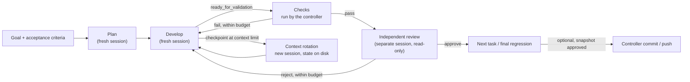
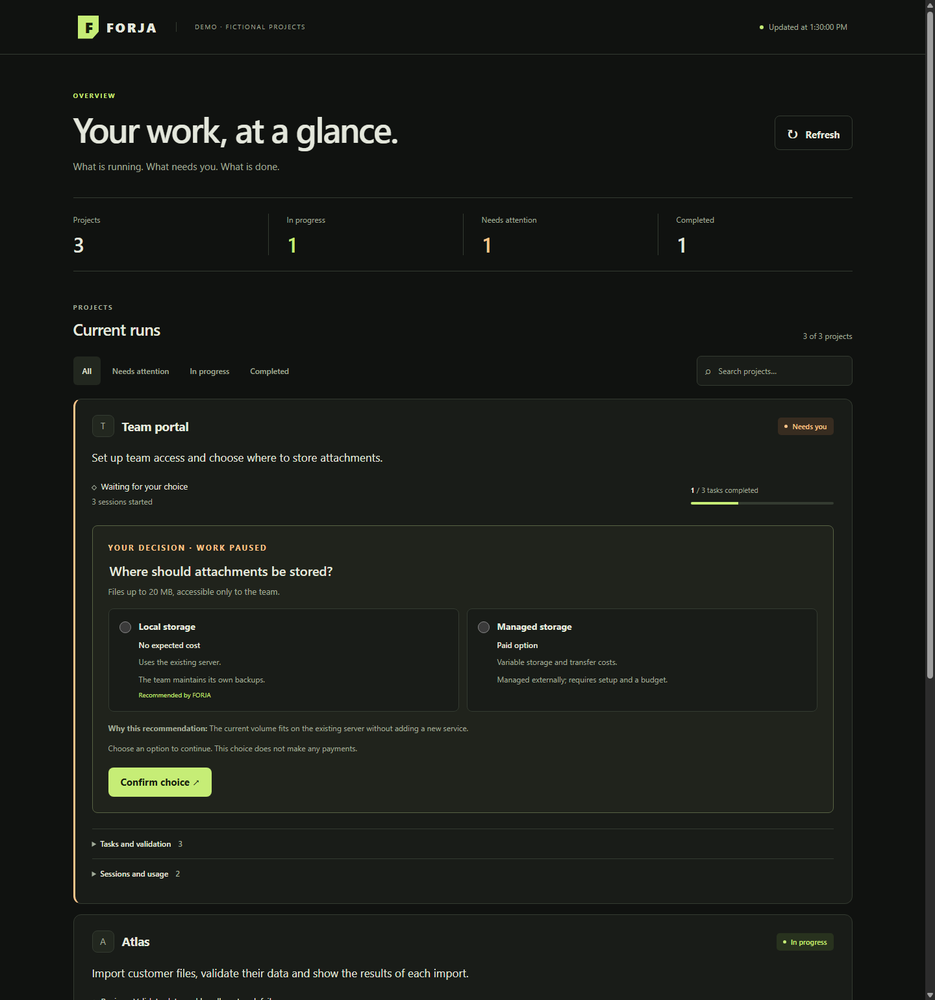
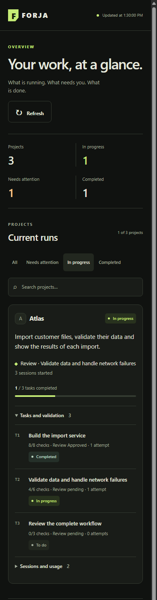

<p align="center">
  
</p>

<h1 align="center">Software work, with evidence.</h1>

<p align="center">A small controller that turns a goal into code changes, executed checks and an independent review.<br>Claude Code and Codex do the engineering. FORJA owns the state, the limits and the definition of done.</p>

<p align="center">
  <a href="https://github.com/nunomarques97/forja/releases/tag/v0.21.2"></a>
  <a href="package.json"></a>
  <a href="package.json"></a>
  <a href="LICENSE"></a>
</p>

<p align="center"><a href="#what-it-is">What it is</a> · <a href="#how-it-works">How it works</a> · <a href="#evidence">Evidence</a> · <a href="#design-decisions">Design decisions</a> · <a href="#quick-start">Quick start</a> · <a href="#troubleshooting">Troubleshooting</a> · <a href="#documentation">Docs</a></p>

## What it is

FORJA is a **zero-dependency Node.js 24 CLI** that runs coding agents against an existing Git project and refuses to call a task finished until the evidence says so.

Coding agents are good at producing plausible changes and bad at knowing when they are actually done. FORJA separates the two concerns:

- **The agent writes code.** Each phase (plan, develop, review) is a fresh native Claude Code or Codex session that receives only the task, its acceptance criteria and a bounded slice of project context.
- **The controller decides completion.** A deterministic Node scheduler owns task state, runs the checks itself, sends the result to a *separate* reviewer session, enforces budgets and recovers from crashes. A worker's "done" is a handoff, not a verdict.

The goal is delivered software that passes its checks and survives an independent review. Using more agents or fewer tokens can help reach that goal, but neither counts as success.

## How it works


```mermaid
flowchart LR
    Goal["Goal + acceptance criteria"] --> Plan["Plan<br/>(fresh session)"]
    Plan --> Dev["Develop<br/>(fresh session)"]
    Dev -->|ready_for_validation| Checks["Checks<br/>run by the controller"]
    Dev -->|checkpoint at context limit| Rotate["Context rotation<br/>new session, state on disk"]
    Rotate --> Dev
    Checks -->|pass| Review["Independent review<br/>(separate session, read-only)"]
    Checks -->|fail, within budget| Dev
    Review -->|reject, within budget| Dev
    Review -->|approve| Next["Next task / final regression"]
    Next -->|optional, snapshot approved| Deliver["Controller commit / push"]
```

1. **Plan.** A planner session turns the goal into tasks with files, acceptance criteria and executable checks. Supply `--plan plan.json` to skip it. The controller validates the plan and emits advisory warnings (`context_scope`, `head_dependency`) for tasks that are too broad or that depend on commits not yet made.
2. **Develop.** A developer session implements one task and its tests, then returns `ready_for_validation`. It cannot mark the task complete.
3. **Check.** The controller runs the task's checks and the caller's `finalChecks` directly, without an implicit shell. A check that modifies source is rejected. With `checkIsolation`, checks run in a bubblewrap sandbox: read-only source, no network, disposable scratch, no host fallback.
4. **Review.** A different session inspects the source, the criteria and the check logs. It must not edit files. A rejection sends concrete findings back to development, within the attempt budget.
5. **Deliver (opt-in).** With `delivery` configured, the final reviewer also approves the exact snapshot to be committed, either as one commit per run or one reviewed commit per task. The controller performs the Git operations. Push requires an explicit deployment contract per project. Workers never commit.

**Budgets are hard limits.** Defaults from [`lib/core/budgets.mjs`](lib/core/budgets.mjs): 30 sessions, 2 implementation attempts per task, 30 minutes per invocation, 2 context rotations and a 120,000-token context limit (measured on each Claude request's input), all configurable within fixed bounds. A failed session that has started still uses up its allowance. FORJA never switches providers automatically and never silently falls back to a paid route.

**Recovery is explicit.** State lives in `.forja/runs/<id>/state.json`, next to prompts, results, patches, check logs and a `usage.jsonl` ledger. Only one writer runs per project: a lock records the controller and its subprocess, and resume refuses to start while either is alive. A recorded developer handoff survives controller death. On recovery, FORJA verifies source and `HEAD`, re-runs the checks and requires a fresh review. If source changed after an approval, that approval no longer counts. Every stopped run reports a fixed `recovery.code` (see [Troubleshooting](#troubleshooting)).

**Sponsor decisions are gates.** Any relevant paid or unknown-cost alternative that a worker reports blocks the run until a person makes an explicit choice in the viewer or with `core decide`. Retries, resume and elapsed time never make that choice.

## Evidence

Measurements taken on the current code (`v0.20.0`, 29 September 2026) unless stated otherwise.

| Indicator | Value | How to reproduce |
|---|---:|---|
| Automated tests | **1,173 tests: 1,167 passed, 0 failed, 6 skipped** (132.7 s) | `npm test -- --test-concurrency=4` |
| Test files | 66 | `test/*.test.mjs` |
| Source / test code | 11,391 lines in `lib/` (5,638 in `lib/core/`) · 19,469 lines of tests | `wc -l` |
| Runtime dependencies | 0 | [`package.json`](package.json) |
| Tagged releases | 36 (`v0.1.0` → `v0.20.1`) | `git tag` |

The suite uses fixtures and simulated executors to cover real subprocess acceptance, repair budgets, timeouts, context-triggered termination, checkpoint rotation, stale validation on resume, locks, symlink/path refusal, state tampering and unexpected commits. Evaluations with real models are separate and recorded in [`docs/RESEARCH.md`](docs/RESEARCH.md) and [`docs/ADAPTIVE-ORCHESTRATION.md`](docs/ADAPTIVE-ORCHESTRATION.md). A few of their results:

- **Independent review catches what green checks miss.** In a bounded asynchronous pilot on the real Core controller, the implementation passed **12/12 external criteria** and its **6/6 worker tests**. The separate reviewer still rejected it because the worker's asynchronous tests awaited progress without a timeout guard, which violated an explicit requirement. Source inspection confirmed the omission. The run was recorded as **0/1 approved deliveries**, not repaired into a success. ([RESEARCH.md](docs/RESEARCH.md#bounded-asynchronous-acceptance-pilot))
- **Oracles are validated before they grade models.** External evaluators were checked against known-correct controls and seeded defects before any model call: 2/2 controls accepted and 11/11, 12/12 and 12/12 defects rejected across three studies. After validation, the oracles were frozen.
- **Candidate features are tested before they are adopted.** A contract-only test-authoring mode rejected the same **23/24** faulty variants as the baseline and accepted **4/4** correct controls, but took **504 s versus 406 s (+24.1%)**. It was not promoted. ([ADAPTIVE-ORCHESTRATION.md](docs/ADAPTIVE-ORCHESTRATION.md#initial-acceptance-study))
- **Token claims are held to the same standard.** Switching knowledge injection from automatic excerpts to explicit references cut total input by 4.6% in one pilot, but input excluding cache rose by 46.4%. The documentation reports both figures and claims no saving.

These are small, frozen experiments with the limits stated in each document. They do not prove reliable autonomous delivery of every complex product.

## Design decisions

These trade-offs shaped the runtime. Each one is backed by the documents above.

1. **An independent reviewer, even when checks pass.** Checks prove what they test, and a worker writes many of its own tests. A separate read-only session that reads the criteria and the source catches missing requirements that a test suite never asks about, as the asynchronous pilot above shows. The reviewer is also a real cost, so its model tier is configurable, but review is never optional.
2. **The controller runs deterministic checks, not the agent.** A worker can only report `ready_for_validation`. Required check failures cannot be waived by a review, and caller-owned `protectedFiles` are hash-pinned so that an agent cannot weaken the oracle to pass. A check that modifies source fails. An impressive partial implementation still counts as a failed run.
3. **Hard budgets instead of optimism.** Every loop has a ceiling: attempts, sessions, cloud sessions, minutes and context rotations. When a ceiling is reached, the run stops with the work preserved and a reason code. Only a person can raise a limit, and the command requires `--why`. Consecutive context-limit sessions that make no progress stop the run instead of burning quota.
4. **Fresh sessions with state on disk.** Each phase starts clean and reads the task, criteria, decisions and a bounded repository map. Nothing is reconstructed from conversation history. At a context limit, the developer returns a `checkpoint` that lists the remaining steps, and a new session continues from it. The result is predictable context size and recovery after a crash.
5. **A small runtime over a framework.** FORJA has no runtime dependencies and needs no agent framework or background service. Larger orchestration and memory platforms were studied ([RESEARCH.md](docs/RESEARCH.md#ruflo--claude-flow)). The rule is to adopt a component only if a controlled test shows better quality per total cost, not because it has more features.

## Quick start

You need **Node.js 24**, **Git**, and an installed, authenticated **Claude Code or Codex CLI** (or a **Kilo CLI** for organization gateways; see [Routing](docs/ROUTING.md#kilo-cli-provider)). FORJA is developed on Windows. Some supervision helpers are Windows-specific.

```powershell
git clone https://github.com/nunomarques97/forja.git
Set-Location forja
$forja = (Resolve-Path .\bin\forja.mjs).Path

# Work from the Git root of the project you want to change.
Set-Location 'C:\path\to\your-project'
node $forja core doctor --provider codex
node $forja start --provider codex --goal "Add name search, preserve existing filters, and test empty results"
```

Use `--provider claude` for Claude Code. It is the default when `--provider` is omitted. The project needs a clean working tree unless you pass `--allow-dirty`. Add `.forja/` to the project's ignore rules, because it holds private run state and logs. The optional `core init` command adds that rule and short instruction references. `core doctor` checks local prerequisites without calling a model or changing the project. It does not confirm login or quota.

`start` stays in the foreground and exits nonzero unless the run completes. To follow a run, open a second terminal:

```powershell
node $forja core status   # tasks, limits, plan warnings and a recovery reason when stopped
node $forja core usage    # per-session tokens, cache and time, with unknown values kept explicit
node $forja serve         # local viewer at http://127.0.0.1:4317/
```

Caller-owned acceptance, passed with `--config acceptance.json`:

```json
{
  "protectedFiles": ["test/acceptance.test.mjs", "test/fixtures/expected.json"],
  "finalChecks": [{ "command": "node", "args": ["--test", "test/acceptance.test.mjs"] }]
}
```

Other opt-in profiles: [`config/core-restricted-claude.json`](config/core-restricted-claude.json) gives Claude workers file tools only, with no shell, no Git and no MCP. [`config/core-full-access.json`](config/core-full-access.json) gives both providers full access in every phase. [Routing](docs/ROUTING.md) covers explicit model and effort per phase, and [delivery](docs/CONTROLLER-DELIVERY.md) covers isolated checks and reviewer-approved commit/push.

### Viewer

`node $forja serve` opens a local, token-authenticated workspace with each project's run, its tasks, checks, reviews and any decisions waiting for you.



<details>
<summary><strong>Mobile view</strong></summary>

<p></p>

</details>

Screenshots use fictional projects and illustrative measurements.

## Troubleshooting

Start with `node $forja core status`. A stopped run reports a fixed `recovery.code`, guidance and its current limits. Work on disk is preserved, so inspect the diff before you act. Recovery commands can only raise budgets, and `retry` and `abandon` require `--why`.

| `recovery.code` | What to do |
|---|---|
| `context`, `rotations` | Inspect the checkpoint, then `core resume --max-rotations N`. |
| `no_progress_between_rotations`, `repeated_context_limit` | The task is too broad. `core abandon --why "..."` and start again with narrower tasks, or explicitly raise the context budget. |
| `attempts`, `sessions`, `cloud_sessions`, `timeout` | Raise the matching limit with `core resume`, or `core retry --task T1 --why "..."`. If the implementation is already complete, add `--validate-only`. Add `--reopen` for an approved task that turned out to be defective. |
| `provider`, `provider_limit` | Fix authentication or quota in the provider CLI, then `core resume`. FORJA does not switch providers. |
| `interrupted` | The controller ended or Ctrl+C stopped it. An interrupted check spends no attempt. Run `core resume`. |
| `check_targets` | A check has a placeholder, a missing executable or a Windows `.cmd` shim. Start a new run with concrete commands, for example `node node_modules/typescript/bin/tsc`. |
| `plan_packet`, `task_packet` | A task's packet exceeds its budget (planning) or the 48,000-character limit (execution); the guidance names the task and its size. For `plan_packet`, `core resume` plans again with those sizes. Otherwise `core abandon --why "..."` and start again with smaller tasks or a shorter goal. |
| `operator_stop` | You ran `core stop`. `core resume` continues from the next step. |

`core diagnose` summarizes what each session did without calling a model. Full procedures (in Portuguese) are in the [Core runbook](docs/CORE-RUNBOOK.md#retomar-e-resolver-bloqueios).

## Status

| Available now | Experimental or proposed |
|---|---|
| Sequential Core workflow, separate review, controller-run checks, protected acceptance, context rotation, crash recovery, explicit routing, isolated checks, reviewer-approved delivery, viewer and diagnostics. | Economy/Ollama presets are opt-in experiments. Dynamic specialist allocation, parallel writers in one project and adaptive replanning are **not implemented**. |

**Current release: [v0.20.1](https://github.com/nunomarques97/forja/releases/tag/v0.20.1).** The privacy scan no longer blocks Core delivery on REST API and route paths such as `users/me/` (#26). Builds on 0.20.0, which adds an optional reviewed commit per task, lets you reopen an approved task with `core retry --reopen`, keeps oversized worker results instead of blocking the run, and stops false dead-session alerts. Earlier releases are listed in the [changelog](CHANGELOG.md) and the [tags](https://github.com/nunomarques97/forja/tags). The legacy `runner` remains available as a compatibility workflow.

For development, run `npm test`, `npm run check` and `npm run release:check`. The release guard scans Git's index for credential-shaped values and private run material before any commit. Read the [publication rules](docs/RELEASE.md) before you stage evidence.

## Documentation

| Start here | Go deeper |
|---|---|
| [Execution contract](docs/CORE.md) | [Core runbook (Portuguese)](docs/CORE-RUNBOOK.md) |
| [Routing, models and presets](docs/ROUTING.md) | [Scheduler](lib/core/engine.mjs) · [Adapters](lib/core/providers.mjs) · [Budgets](lib/core/budgets.mjs) |
| [Isolated checks and delivery](docs/CONTROLLER-DELIVERY.md) | [Specialist methods](docs/CORE-SPECIALISTS.md) |
| [Research and measured pilots](docs/RESEARCH.md) | [Adaptive orchestration study](docs/ADAPTIVE-ORCHESTRATION.md) |
| [Release and privacy policy](docs/RELEASE.md) | [Changelog](CHANGELOG.md) |

[MIT](LICENSE) · Copyright (c) 2026 Nuno Marques.
