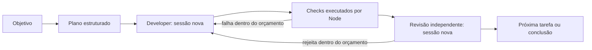

# FORJA Core

Manual de referência dos novos runs. [CORE.md](CORE.md) é o contrato curto enviado aos executores; [AGENTS.md](../AGENTS.md) rege o desenvolvimento do FORJA. O viewer tem uma página Core em `/core`; a arquitetura/runbook antigos continuam a documentar a compatibilidade com `runner`.

## Arrancar

Antes do primeiro run, usa `node $forja core doctor --provider codex` (ou `claude`), na raiz Git do projeto; acrescenta `--config` se usares rotas próprias. Verifica Node, Git, raiz do projeto, alterações pendentes, exclusão de `.forja/`, configuração e presença dos executores. Não chama modelos, lê credenciais nem escreve no projeto. `ready: true` confirma apenas requisitos locais: autenticação, acesso ao modelo e quota continuam por verificar no CLI do provider. Avisos sobre alterações pendentes ou `.forja/` exigem revisão; `core init` pode preparar instruções e o ignore, mas essas alterações precisam de revisão antes de um arranque com árvore limpa.

O doctor aplica aos budgets de execução as mesmas regras do arranque: `maxSessions` 1–200 (default 30), `maxAttempts` 1–5 (2), `maxMinutes` 1–180 (30), `maxRotations` 0–5 (2) e `maxContextTokens` 1.000–1.000.000 (120.000). Aceita inteiros e strings numéricas inteiras sem alterar a configuração; um valor inválido devolve um erro de configuração antes de inspecionar executores. `maxCloudSessions` mantém a validação estrita de routing: número inteiro 0–200.

Requisitos: Node 24, Git e Claude Code ou Codex instalado e autenticado. Na raiz Git do projeto:

```powershell
$forja = 'C:\tools\forja\bin\forja.mjs'
node $forja start --provider codex --goal "Adicionar pesquisa por nome, mantendo os filtros e testando os casos vazios"
node $forja core status
node $forja core usage
node $forja core diagnose
```

Claude só muda `--provider claude`. De outra pasta, acrescenta `--project 'C:\caminho\projeto'`. Com alterações pendentes, revê-as e usa `--allow-dirty` para autorizar a execução nesse estado. Os hashes iniciais não são um backup: o agente tem acesso de escrita e deve preservar trabalho existente. Sem `delivery`, Core não faz commits nem publica. Uma decisão pendente sobre tecnologia paga ou custo incerto pode enviar uma notificação de estado ao Sponsor, se o transporte existente estiver configurado.

As opções `checkIsolation` e `delivery` estão descritas em [isolamento e entrega](CONTROLLER-DELIVERY.md). A primeira executa checks Linux num snapshot só de leitura através de bubblewrap, sem fallback para o host. A segunda acrescenta a decisão de entrega ao reviewer final existente, sem sessão adicional; o controlador faz commit e, quando autorizado, push. A entrega exige arranque limpo, manifesto aprovado e contrato de publicação/produção estável. `core deliver --retry` retoma apenas a entrega após inspeção; `core deliver --approve-production <sha>` autoriza o commit concreto já revisto, sem mudar defaults do projeto.

`core init` é opcional: acrescenta uma referência a CORE.md em blocos geridos de AGENTS/CLAUDE e ignora `.forja/`. Preserva as regras existentes e recusa marcadores inválidos. O arranque direto já envia CORE.md; se dispensares init, acrescenta `.forja/` ao `.gitignore` para não versionar logs privados. Não copies o catálogo antigo de agentes para novos projetos.

Antes de escrever, `core init` inspeciona `AGENTS.md`, `CLAUDE.md`, `.gitignore` e `.forja` sem seguir ligações: cada ficheiro, se existir, tem de ser um ficheiro regular, e `.forja` tem de ser uma pasta real. Symlinks e junctions são recusados nos quatro destinos; pastas são recusadas nos destinos de ficheiro. Nomes ausentes são permitidos. Os marcadores geridos de todos os ficheiros de instruções são validados antes da primeira escrita, por isso um `CLAUDE.md` inválido deixa `AGENTS.md` intacto.

Os bytes originais de cada saída são guardados em memória antes da escrita; as escritas são feitas no próprio ficheiro, sem ficheiros temporários, e só quando o conteúdo muda. Se uma escrita ou a criação de `.forja` falhar dentro do processo, init repõe os bytes exatos dos ficheiros que já existiam, remove as saídas que criou e apaga `.forja` apenas se foi criada nesta chamada e continua vazia. O conteúdo anterior de `.forja` e os restantes ficheiros ficam intactos, e o erro original é propagado. Todas as ações de reposição são tentadas mesmo que uma falhe; nesse caso o erro indica `rollback is incomplete`, lista apenas nome do ficheiro e código de erro (por exemplo `CLAUDE.md (EACCES)`), mantém a falha original em `cause` e nunca inclui conteúdo dos ficheiros. Revê esses ficheiros manualmente antes de repetir init.

Limites: a reposição é de melhor esforço e não é atómica entre vários ficheiros. Um crash do processo, corte de energia ou falha do sistema a meio pode deixar escritas parciais. Init também não protege contra editores ou processos externos a alterar os mesmos caminhos em simultâneo, nem contra corridas entre a verificação inicial e a escrita (TOCTOU). Corre-o com o projeto parado e revê o diff resultante.

## Migrating a legacy project

Stop the project's executors first, preserving unfinished changes. Run `node <forja>/bin/forja.mjs core init` from the project root. Init replaces the old `forja:begin` managed block with Core guidance, consolidates it with an existing Core block, and retains all instructions outside those blocks. It disables automatic invocation of recognized legacy skills using `disable-model-invocation: true`, preserving their bodies for explicit legacy use. It does not copy a crew, alter model profiles, close runs, launch workers or change publication permission.

Claude Code ignores a skill header that is not valid YAML, including the flag, so init validates each legacy skill header after the change. A plain value that YAML would reject, such as a description containing `: `, is quoted; any other invalid header stops init before it writes anything. Running init again on an already migrated project repairs such headers and is otherwise idempotent. Malformed, duplicate or overlapping markers and unrecognized legacy skill files fail before writing. Existing skill destinations receive containment and rollback protection. Review the resulting diff; restart the conversation so a previously loaded Lead method cannot continue driving it. Legacy skills remain readable as files or explicitly invocable by the user; see [Claude skill invocation control](https://code.claude.com/docs/en/skills#control-who-invokes-a-skill).

If `docs/forja/RUN.json` still records a running or blocked run, close it explicitly after confirming its executors have stopped. Use `run fail --why "Stopped for Core migration; unfinished work preserved"` for an interrupted run; never mark incomplete work finished. Migration alone leaves that state intact, and Core continues to refuse an active legacy run. Supply the selected `--config` profile on the new Core run and inspect pending changes before using `--allow-dirty`.

Guidance is portable: resolve the installation from the caller, `FORJA_ROOT`, or an existing FORJA hook path. Do not commit a local home path. Historical references to crew roles do not authorize manual delegation in a Core run; map applicable product constraints to the controller's phases.

## Acesso completo dos executores

Para permitir acesso completo em **plan, develop e review**, seleciona o perfil [core-full-access.json](../config/core-full-access.json):

```powershell
node $forja start --provider codex --config C:\tools\forja\config\core-full-access.json --goal "Implementar o objetivo"
```

O mesmo perfil funciona com `--provider claude`. Numa configuração com modelos/rotas próprios, acrescenta `"providers": {"codex": {"fullAccess": true}, "claude": {"fullAccess": true}}`, preservando os restantes campos de cada provider. O perfil de acesso não escolhe modelos nem aumenta limites.

Codex recebe `--sandbox danger-full-access` e `approval_policy="never"`. Claude recebe `--permission-mode bypassPermissions`, `--tools default` e `--settings {"sandbox":{"enabled":false}}`. Isto elimina as restrições de sandbox e os pedidos de aprovação nativos que o FORJA configura, incluindo nas fases antes limitadas a leitura. A configuração MCP explícita mantém-se. Permissões do sistema operativo, políticas administradas, autenticação e disponibilidade das ferramentas continuam a depender do ambiente; acesso completo não eleva o processo a administrador.

Sem `fullAccess: true`, mantém-se o comportamento anterior. O valor deve ser booleano; executores `custom` configuram permissões no próprio comando. A configuração é guardada no novo run; não altera retroativamente runs existentes nem o workflow legado `runner`.

Planner e reviewer mantêm as suas funções: não alteram código do projeto. Um reviewer com acesso completo pode usar espaço temporário fora do projeto para verificações adicionais. O Core continua a detetar alterações indevidas ao código/estado e aos ficheiros protegidos. Checks obrigatórios, limites e decisões do Sponsor sobre custos mantêm-se.

Referências dos executores: [Codex sandboxing](https://learn.chatgpt.com/docs/sandboxing), [Claude CLI](https://code.claude.com/docs/en/cli-reference) e [Claude sandboxing](https://code.claude.com/docs/en/sandboxing).

## Arquitetura e estado



Node controla dependências, tentativas e transições. Não há Lead a delegar cada tarefa, mínimo de tarefas, PM/Scout/Architect obrigatório ou agentes de relatório. Um plano explícito `--plan plan.json` dispensa o planner. O percurso normal tem uma invocação de planeamento e duas por tarefa; cada invocação pode conter várias chamadas ao modelo.

Ao fornecer um plano, começa pela menor unidade que entregue um comportamento completo e verificável. Cálculo e apresentação sobre os mesmos ficheiros podem pertencer à mesma tarefa quando cabem no contexto e no limite de execução. Sem reparações, passar de duas tarefas para uma reduz as sessões de desenvolvimento/revisão de quatro para duas, mantendo uma revisão independente e os checks finais. Divide quando houver critérios que possam ser aceites separadamente, riscos distintos ou trabalho que exceda os limites; partilhar ficheiros, por si só, não justifica fundir tarefas. O planner já recebe esta preferência por tarefas coesas; planos explícitos continuam sob controlo do autor.

O planner recebe também `planning_contract`: o limite de contexto de cada sessão de desenvolvimento (`develop_context_tokens`), a base estimada do provider (~35.000 tokens de system prompt, ferramentas e pacote FORJA no primeiro pedido Claude) e o contexto de trabalho que sobra. É instruído a dividir auditorias, revisões e investigações amplas por área, cada uma com critérios e checks próprios. Depois do planeamento, o Core faz uma verificação determinística e apenas consultiva: uma tarefa de leitura (audit, review, investigate…) que cubra duas ou mais pastas inteiras, ou qualquer tarefa com quatro ou mais, gera um aviso `context_scope`. O mesmo contrato indica o modo de entrega do run (`delivery`: `none`, `commit` ou `push`) e `commits_during_run: false`: os workers nunca fazem commit e não há commit entre tarefas, por isso o HEAD fica no commit inicial durante todo o run; com entrega configurada, o controlador cria no máximo um commit depois de todas as aprovações. O planner é instruído a não planear passos que precisem do trabalho do run no HEAD, em commits ou no histórico Git (exportar o HEAD, `git log` do trabalho novo, commits por tarefa): trabalham sobre a working tree ou ficam para um run seguinte, registado nas decisões. Uma tarefa que não é a primeira e cujos critérios referem HEAD, conteúdo commitado ou `git log/show/archive/ls-tree/cat-file/rev-list` gera o aviso `head_dependency`. Os avisos aparecem no log (`FORJA plan warning: …`) e em `plan_warnings` de `core status`; não alteram nem rejeitam o plano. Para repartir, abandona o run e começa outro com tarefas mais estreitas.

O planner faz a descoberta de código antes de devolver o plano e mantém os testes de aceitação na tarefa que implementa o comportamento. Quando dividir trabalho, deve explicar o motivo nas decisões. Os checks são executáveis e argumentos lançados diretamente, sem shell implícita: um comando interno como `Get-Content` não é um executável nem um teste de comportamento. Estas instruções orientam o modelo; não fundem tarefas nem certificam semanticamente os checks propostos.

### Escolhas de tecnologia e custos

Novos runs incluem `technology` no resultado estruturado. Trabalho corrente na stack aceite devolve `[]`. Uma capacidade nova, dependência material ou escolha consequente por resolver pede duas ou três alternativas viáveis, restrições, vantagens/limitações, evidência consultada e recomendação. A comparação acontece no planner existente, limitada a três referências primárias por escolha; não cria uma fase Scout nem uma sessão obrigatória adicional. Os limites de tempo/sessões mantêm-se. O modelo pode demorar mais a investigar uma escolha real; não existe uma garantia de latência igual.

O controlador obtém e guarda a resposta do Sponsor antes do trabalho. O planner não deve criar uma tarefa para perguntar, esperar ou confirmar essa resposta. Workers que usam uma escolha já registada devolvem `technology: []`; podem mencionar a confirmação em `summary`. O campo só contém escolhas novas por resolver. Repetições e alterações a uma decisão existente continuam a ser recusadas; uma restrição alterada exige `blocked` com explicação, sem substituir a resposta do Sponsor.

Cada opção indica `free`, `paid` ou `unknown` e a base desse custo. Um nível gratuito só conta como gratuito quando cobre os requisitos. Basta existir uma alternativa relevante paga ou incerta para o Core persistir o bloqueio, mesmo recomendando a gratuita. Opções todas gratuitas podem ser escolhidas automaticamente, com justificação. Custos já aprovados e o provider de execução configurado não são reavaliados a cada tarefa. Developer/reviewer que descobrem novos custos devolvem `blocked` e alternativas antes da adoção; o controlador também impede conclusão se um resultado `done`/`approve` trouxer essa decisão pendente.

O Sponsor escolhe no painel autenticado `/core`, sem opção pré-selecionada, ou no terminal:

```sh
node bin/forja.mjs core status
node bin/forja.mjs core decide --run F-1234567890000-abcdef --decision D1 --option local --why "Preferir manutenção local"
node bin/forja.mjs core resume
```

O painel guarda a resposta e tenta iniciar a continuação depois da última decisão. O CLI apenas guarda; `resume` retoma. Respostas repetidas iguais são idempotentes; outra resposta para uma escolha resolvida é recusada. Run obsoleto, worker ativo, opção inexistente e pedido de outra origem são recusados. A decisão não aumenta budgets nem autoriza comprar, subscrever, aceder a credenciais ou pagar. Enquanto faltar uma resposta, `resume`, `retry`, guarda e passagem do tempo não escolhem pelo Sponsor. A espera não mantém um modelo ativo.

A notificação usa `FORJA_NTFY_TOPIC` ou `data/notify-config.json`, conforme [RELEASE.md](RELEASE.md). Envia apenas estado e, quando disponível, link sanitizado para `/core`; nunca inclui alternativas, conteúdo de projeto ou token de acesso. A tentativa fica registada antes do envio, com teto de cinco segundos, e não se repete para o mesmo conjunto pendente. Transporte indisponível, configuração ausente ou interrupção durante o envio podem impedir a entrega; o bloqueio continua visível no painel/CLI. Reiniciar não garante reenviar uma tentativa interrompida.

O gate é determinístico sobre custos **reportados**. Classificar custos, identificar alternativas e avaliar fontes continua a depender do modelo e da informação disponível; isto não é um detetor completo de serviços pagos nem um isolamento de rede/faturação. Os contratos e sandboxes existentes continuam a aplicar-se. Runs anteriores sem esta política continuam legíveis; não recebem retroativamente uma pesquisa nova. Estado limitado a oito decisões e 16.000 caracteres; contexto global continua limitado a 48.000.

`.forja/current.json` guarda o estado corrente. `.forja/runs/<id>/state.json` conserva cada run, acompanhado por prompts, schemas, resultados, streams, patches e logs dos checks. `usage.jsonl` mede invocações; `recovery.jsonl` regista intervenções explícitas; `SUMMARY.md` é gerado por código. Os logs podem conter código/dados privados. Runs anteriores ficam preservados.

Há um escritor por projeto. O lock regista controlador e subprocesso; a retoma recusa processos vivos. Recuperação de lock obsoleto é serializada. Estado inválido, paths exteriores/symlinks, alteração do estado pelo worker e commits inesperados interrompem o run. Estas verificações não substituem uma sandbox contra executores maliciosos.

Para novos runs Claude, `config/core-restricted-claude.json` ativa `providers.claude.writePolicy: "restricted"`: desenvolvimento apenas com ferramentas de ficheiros, planeamento/revisão só de leitura, sem shell/Git/MCP/subagentes. Requer CLI 2.1.280+, recusa `fullAccess`, argumentos adicionais e MCP configurado; não enfraquece silenciosamente o modo. Os testes executam no controlador. Todas as invocações recebem temporários exclusivos e retidos, identificados em `access.scratch` no ledger; atribuir temporários não confina os modos anteriores. Ver garantias, limites e exemplo em [Routing](ROUTING.md#restricted-claude-file-tools). A política nova é explícita e não altera runs existentes.

## Diagnóstico local de execução

`core status` inclui orientação de recuperação com motivos fechados, também visível no viewer sem copiar erros brutos, argumentos ou caminhos privados. Runs antigos sem motivo estruturado mostram orientação genérica, sem inferir uma causa a partir do texto. Um processo ausente num run marcado `running` é apresentado como interrompido; isso não equivale a trabalho concluído.

Checkpoints guardam uma entrega durável ligada à fonte e ao HEAD. Após reinício, essa entrega pode ser recuperada sem contabilizar a mesma continuação duas vezes. Um checkpoint não consome uma tentativa de implementação; ao esgotar as rotações, permanece bloqueado até aumentares `--max-rotations`. Uma recusa de orçamento anterior ao lançamento também não gasta tentativa. Timeout ou falha de provider continuam sem retry automático: inspeciona o diff e, se a implementação já estiver pronta, usa `core retry --task ID --validate-only --why "..."`; os checks e a revisão continuam obrigatórios. Para novo desenvolvimento, aumenta explicitamente o orçamento de tentativas se necessário. Recibos de versões anteriores apenas guardados como texto não são convertidos automaticamente em entregas aprovadas.

Os limites têm âmbitos diferentes: `--max-sessions` limita sessões totais; `--max-cloud-sessions` limita sessões cloud; `--max-minutes` limita cada chamada e pode ser reduzido por uma rota. A retoma só permite aumentar budgets e regista limites anteriores/novos; aumentar sessões totais não ultrapassa um limite cloud explícito. Nenhum destes valores altera a quota da conta. `--max-context-tokens` usa observações do input de cada pedido Claude (incluindo cache), não tokens acumulados; Codex/custom não fornecem uma medida live comparável neste adapter e não se afirma um stop de contexto para eles. O ledger guarda os limites efetivos de cada chamada. Um evento explícito de quota/rate limit recusado pelo Claude é distinguido de avisos; causas desconhecidas continuam falhas genéricas.

`node bin/forja.mjs core diagnose --project <projeto>` resume o ledger e os ficheiros `call-N-events.jsonl` do run atual, incluindo runs terminados. É uma leitura pedida explicitamente: não chama modelos, não retoma tarefas e não acrescenta instrumentação ao percurso de execução. Não lê prompts, saídas brutas dos providers nem sessões nativas; não envia notificações.

Para focar uma invocação ou fase, usa seletores opcionais e combináveis (AND):

```powershell
node $forja core diagnose --invocation 3
node $forja core diagnose --phase review
node $forja core diagnose --invocation 3 --phase develop
```

`--invocation` aceita só decimal canónico de 1 a 200 (sem sinal, espaços, zeros à esquerda, ponto decimal, expoente ou hexadecimal); `--phase` aceita `plan`, `develop` ou `review`. Um valor em falta ou inválido termina com código diferente de zero e a mensagem genérica `Invalid diagnostic filters.`, sem repetir o valor e antes de ler ficheiros do projeto. O filtro aplica-se depois de reconciliar o ledger completo e o registo pendente: os avisos globais (`warnings` do run/ledger, como `missing_invocation_records`) descrevem sempre o ledger completo e não são filtrados. Só os journals das invocações selecionadas são lidos e contam para o limite de leitura. Sem correspondência, o relatório mantém o mesmo formato com `invocations: []`. Com ou sem seletores, o comando continua só de leitura e não invoca nenhum provider.

Por invocação, mostra o resultado do processo e a duração disponível, operações observadas por tipo, falhas, operações sem evento final, primeira alteração de ficheiro concluída e último evento. `observed_tool_span_ms` une intervalos entre eventos de início/fim correspondentes, sem somar duas vezes ferramentas sobrepostas. `outside_observed_tool_spans_ms` é o tempo restante; inclui trabalho e espera que o protocolo não permite atribuir. Não representa tempo desperdiçado, ocioso ou exclusivamente de inferência. Os tempos são de receção de eventos, sujeitos ao buffering do CLI. Um evento de edição não prova código correto, nem um comando com código zero substitui aceitação/revisão. `returned` não significa entrega válida ou aprovação.

`coverage: recorded` significa que não foram detetadas lacunas no journal lido, não que o provider tenha exposto todas as operações nativas. `partial` assinala truncamento, eventos inconsistentes ou dados descartados; `unavailable` mantém métricas desconhecidas. O resumo de ferramentas suporta metadata Codex v1. Outros providers, versões desconhecidas e runs antigos sem journal ficam explicitamente indisponíveis. Uma operação `open` não tem evento final registado; não é prova de que o processo continua vivo. Num run ativo, o relatório é apenas uma fotografia dos ficheiros disponíveis e não inventa duração final.

O ciclo de vida de cada ferramenta segue o primeiro registo aceite. Uma ferramenta sem fim aceite gera `missing_tool_finish` e deixa `coverage: partial`, mesmo com registo final válido. `item.started`/`item.updated` exigem estado `in_progress` e `item.completed` exige `completed`, `failed` ou `declined`; outro estado gera `unknown_tool_status` e é ignorado sem criar nem alterar operações. Um segundo início, ou início/atualização depois do fim, gera `conflicting_tool_event` sem mudar o intervalo. Um fim repetido só é silencioso com o mesmo estado e o mesmo `exit_code` normalizado (inteiro seguro; caso contrário nulo); qualquer diferença é conflito, mesmo que ambos contem como falha. Mantêm-se o primeiro instante de fim, a contagem de falhas e a primeira alteração de ficheiro. Um registo `end` com `dropped_events`/`unparsed_lines` inválidos, ou `recorded_events` presente mas inválido, gera apenas `invalid_record`: não fecha o journal nem deriva outros avisos, e os eventos seguintes continuam a ser lidos. Só um `end` válido fecha o journal (com `record_count_mismatch` se a contagem divergir); sem ele mantém-se `missing_end_record`. Registos depois desse fecho geram `invalid_record` e são ignorados.

A leitura limita-se a 4 MiB por ficheiro, 16 MiB por pedido, 200 invocações e 10.000 eventos por journal. Limites e problemas de leitura aparecem como avisos. Caminhos de logs indicados no ledger não são seguidos; o comando usa os nomes esperados dentro do projeto e recusa ficheiros simbólicos finais. O resultado contém metadata selecionada e avisos fixos, não conteúdo das ferramentas. Não altera os ficheiros observados nem infere tokens/custos em falta.

## Contexto e conhecimento

Cada sessão recebe regras comuns estáveis, objetivo, tarefa/critérios, decisões compactas, títulos concluídos, último feedback útil e referências à evidência. O mapa de paths e declarações tem limite de 6.000 caracteres; o pacote tem limite de 48.000. Se não couber, pára para repartir a tarefa em vez de cortar critérios.

O pacote identifica também as tarefas restantes (critérios, paths e dependências) e se os checks finais são exigidos na tarefa atual. Developer e reviewer usam a mesma fronteira de aceitação do scheduler: alterações de suporte e regressões da tarefa atual são obrigatórias; trabalho atribuído a tarefas seguintes não deve ser antecipado só por partilhar ficheiros. Os checks finais continuam visíveis como contexto de integração. Isto é orientação explícita, não uma sandbox de ficheiros nem prova de que o modelo respeitará a divisão; os critérios restantes contam para o mesmo limite de contexto.

A orientação adicional de âmbito só é enviada quando há outras tarefas pendentes. Planeamento, tarefas únicas e integração final não recebem esse texto redundante; a indicação estruturada da aplicabilidade dos checks permanece.

O mapa é heurístico, não um AST nem uma prova do comportamento. `.forja/index.json` guarda símbolos/hashes; metadata alterada força releitura. O agente recupera código e instruções hierárquicas quando necessário. O revisor recebe paths alterados, patch contra a base do run, indicação de ficheiros novos e logs. Ficheiros partilhados podem incluir alterações anteriores. Não recebe conversas passadas.

Decisões do plano vivem no estado; decisões duradouras do produto continuam no Markdown pertinente. A pesquisa BM25 seleciona excertos pertinentes com path, linhas e hash, até seis excertos e 6.000 caracteres serializados. O manifesto opcional `docs/forja/KNOWLEDGE.json` pode limitar o corpus e exigir notas curtas completas; notas obrigatórias ausentes, demasiado grandes ou com dependências de código desatualizadas interrompem a execução. Perfis, tecnologia, decisões e design não são colados inteiros por defeito. Obsidian pode apresentar esses Markdown e ligações entre projetos; não reduz tokens por si só. Não se acrescentaram embeddings, SQLite nem MCP de pesquisa sem evidência de que o índice simples seja insuficiente. Cache de prompts pertence ao provider: prefixos estáveis não garantem acertos de cache nem significam tokens eliminados.

## Qualidade, risco e modelos

A configuração opcional `finalChecks` acrescenta checks de aceitação definidos pelo autor do run à última tarefa por concluir, antes da revisão. Não exige que tarefas intermédias já satisfaçam o objetivo inteiro. As rotas `routes`/`providers`, o orçamento `maxCloudSessions` e os presets estão em [Routing e qualidade](ROUTING.md); sem rotas explícitas, mantêm-se os defaults descritos abaixo.

Quando o fim dos checks da tarefa coincide exatamente com o início de `finalChecks`, essa sequência é executada uma vez na integração. Comandos e argumentos têm de ser iguais e na mesma ordem; não se normalizam aliases ou paths. As duas sequências mantêm a sua ordem e as repetições explícitas dentro de cada lista. Checks iguais separados por outros comandos continuam a executar-se, tal como a revalidação exigida quando a fonte muda.

Cada tarefa precisa de critérios e checks (`command` e array `args`, sem concatenação de shell). Node executa-os e grava saída, duração e código. Uma falha volta ao developer dentro do orçamento, sem comprar uma revisão. O revisor inspeciona código/evidência sem editar. No fim, checks anteriores cujo código mudou são repetidos; regressões reabrem tarefas sob os mesmos limites.

Os checks devem validar a mesma versão dos ficheiros do projeto. Após cada comando, incluindo comandos que falham, o Core compara o conteúdo com o início da validação. Uma alteração bloqueia o run antes do check seguinte, revisão ou reparação automática; preserva alterações e logs para inspeção. Isto aplica-se também à regressão final. Usa modos de verificação sem escrita para formatadores e geradores; prepara código gerado durante a implementação. Artefactos em pastas ignoradas pelo Git continuam permitidos. A comparação cobre ficheiros tracked e novos não ignorados, excluindo `.forja/`; não é uma sandbox nem deteta alterações desfeitas dentro do mesmo comando. Depois de corrigir a causa e inspecionar a fonte, retoma a validação pelos comandos de recuperação existentes.

O plano marca `security`, `visual` ou `architecture`. Paths/diff acrescentam sinais de segurança (autenticação, dependências, execução, rede, etc.) e UI. Superfícies novas não inspecionáveis elevam segurança. São heurísticas, não deteção completa. Arquitetura orienta plano/modelo; segurança e visual são focos obrigatórios da revisão quando aplicáveis, sem especialista separado por defeito. UI exige evidência real de browser/screenshots, produzida pelo developer e inspecionada pelo revisor. Core não inclui um serviço de browser.

| Condição | Tier |
|---|---|
| Desenvolvimento fácil | fast |
| Planeamento/desenvolvimento médio | normal |
| Difícil, arquitetura, segurança ou nova tentativa | strong |
| Revisão normal | strong |
| Revisão com segurança | critical |

Claude usa Sonnet nos dois primeiros tiers e Opus nos outros. Codex mantém o modelo da configuração do utilizador até mapeares os tiers. Exemplo Claude para `--config forja-config.json`:

```json
{
  "maxSessions": 30,
  "maxAttempts": 2,
  "maxMinutes": 30,
  "maxRotations": 2,
  "maxContextTokens": 120000,
  "provider": {
    "models": { "fast": "sonnet", "normal": "sonnet", "strong": "opus", "critical": "opus" },
    "efforts": { "fast": "medium", "normal": "high", "strong": "high", "critical": "high" }
  }
}
```

Para Codex, usa modelos disponíveis na tua conta ou omite `models`; effort passa a `model_reasoning_effort`. O suporte aos valores depende do modelo/CLI. Omissão conserva o default nativo. `maxMinutes` é por invocação; checks têm teto de 10 minutos. Máximos configuráveis: 30 tarefas, 200 invocações, 5 tentativas por tarefa e 5 rotações.

## Retomar e resolver bloqueios

O developer pode devolver `ready_for_validation` depois de implementar e executar testes focados. Entrega ao controlador os `task.checks` e os `final_checks` aplicáveis, identificando no resumo o que executou e o que ficou por executar. O controlador corre esses comandos e só depois pede revisão independente; esta entrega não conclui a tarefa nem afirma que os checks passaram. Evidência visual, de segurança ou outra que os comandos não produzam continua a ser responsabilidade do worker. Falhas mantêm os limites de reparação e a proteção contra alterações de código durante os checks. Resultados `done` existentes continuam aceites e passam pelos mesmos gates. Timeouts e mensagens intermédias nunca são convertidos automaticamente numa entrega válida.

A partir de 0.8.2, uma entrega válida `done` ou `ready_for_validation` fica registada no estado antes da publicação do resultado. Se o controlador morrer depois desse registo e antes da passagem para validação, a retoma recupera a entrega sem repetir o developer nem gastar outra tentativa/sessão. Os checks e a revisão continuam obrigatórios e sujeitos aos budgets existentes. O registo vincula tarefa, tentativa, invocação, conteúdo do projeto e Git HEAD; alterações à fonte ou HEAD bloqueiam a reutilização e preservam o trabalho para inspeção.

`retry` explícito da tarefa descarta esse registo, incluindo com `--validate-only`. Se a entrega contiver escolhas de tecnologia, retoma primeiro para as processar: a recuperação não pode apagar evidência de custos por resolver. Restaura a fonte/HEAD da entrega se tiverem sido alterados, ou abandona o run para iniciar outro objetivo. Resultados antigos sem este registo não são promovidos automaticamente a entregas recuperáveis. A garantia cobre morte do processo após o registo; não cobre falha de energia/disco nem efeitos externos dos workers. Checkpoints, respostas bloqueadas e invocações sem resultado válido mantêm o comportamento anterior.

Ctrl+C durante um subprocesso termina-o e preserva o trabalho. Uma morte abrupta pode deixar um worker vivo, verificado antes da retoma:

```powershell
node $forja core status
node $forja core resume
```

Cada tarefa/revisão usa uma sessão nova. Um resultado `checkpoint` guarda passos restantes e abre outra sessão sem tentativa adicional de implementação, mas consome invocação/rotação. Claude também é interrompido ao emitir uma métrica de contexto que atinge o limiar: a próxima sessão continua pelo diff, pelos critérios e pelas notas de progresso. O limite só atua depois de receber a métrica.

Cada sessão de desenvolvimento recebe um ficheiro `progress-notes.md` na sua pasta scratch privada (também em `FORJA_PROGRESS_NOTES`), nunca nos ficheiros do projeto. O Core semeia-o com as notas da sessão anterior da mesma tarefa, diz ao worker o limiar de contexto e pede-lhe que registe o que fez, o que leu e concluiu, os passos restantes e os ficheiros relevantes. No fim da sessão, seja qual for o motivo, o Core lê o ficheiro (até 8.000 caracteres guardados em `tasks[].progress_notes`) e entrega-o à sessão seguinte da tarefa no campo `progress_notes` do pacote. O worker não precisa de abrir streams brutos em `.forja/runs/`. Não há aviso a meio da sessão: o adapter Claude corre em `-p` com o stdin fechado e uma mensagem nova só seria lida depois de o turno acabar; por isso o worker é instruído a manter as notas atualizadas desde o início.

Deteção de livelock: uma sessão cortada pelo limite de contexto que não altera a árvore de fontes nem as notas conta como rotação sem progresso (`tasks[].stalled_rotations`). Ao fim de duas seguidas, o run bloqueia com o motivo `no_progress_between_rotations` em vez de gastar outra rotação. Reparte a tarefa por áreas de leitura mais pequenas (abandona o run e começa outro com tarefas mais estreitas) ou, se a tarefa couber com mais contexto, retoma com `--max-context-tokens` maior. Checkpoints pedidos pelo próprio worker e sessões com progresso repõem o contador. Codex não expõe contexto por chamada neste protocolo: usa sessões novas, checkpoint explícito e compactação nativa; não há garantia de corte a 120k para Codex.

Falhas de autenticação, quota, timeout ou formato param sem retries automáticos. Corrige a causa e retoma; invocações/tentativas iniciadas continuam contadas. Para uma tarefa `blocked` ou orçamento esgotado:

```powershell
node $forja core retry --task T1 --why "Dependência corrigida" --max-attempts 3
node $forja core resume --max-sessions 40
node $forja core retry --task T1 --validate-only --why "Ambiente de testes corrigido; validar trabalho preservado"
node $forja core abandon --why "Objetivo substituído"
```

`retry` preserva alterações/contadores; recusa tarefas concluídas e limites esgotados sem aumento explícito. `--validate-only` começa nos checks, sem nova implementação, e continua a exigir revisão independente. `abandon` termina como `failed` e permite novo objetivo, mantendo ficheiros/evidência. Código alterado entre checks e revisão invalida a evidência e força nova validação. Desde 0.8.2, alterações após a última aprovação e antes de o run terminar também exigem novos checks e revisão; passar a regressão final não renova uma aprovação sobre outra versão. A retoma sem alterações não chama outro revisor, e runs já terminados não são reabertos automaticamente.

Não apagues um lock que indica processo vivo: inspeciona os PIDs em `.forja/lock.json`. Um `takeover.json` deixado por recuperação interrompida exige verificar o PID e lock antes de remover apenas esse guard. `call-N-stream.json` explica erros do provider; `<tarefa>-aN-check-K.log` explica checks; `core usage --details` mostra invocações. A guarda reconhece Core e só retoma runs interrompidos ainda marcados como ativos, com os intervalos e limites existentes; nunca reabre um bloqueio explícito nem compete com um worker vivo.

## Proteger o contrato de aceitação

Para um novo run, declara em `--config` os ficheiros de aceitação que devem permanecer intactos:

```json
{
  "protectedFiles": ["test/acceptance.test.mjs", "test/fixtures/expected.json"],
  "finalChecks": [{"command": "node", "args": ["--test", "test/acceptance.test.mjs"]}]
}
```

O Core guarda os hashes dos ficheiros existentes no arranque e verifica-os antes/depois dos workers e dos checks, incluindo a validação final e a retoma. Alteração, remoção ou substituição por link bloqueia o run antes de continuar. Os ficheiros alterados ficam preservados; não são restaurados automaticamente. O worker recebe os caminhos protegidos e pode acrescentar testes próprios em ficheiros separados. Se o contrato estiver errado, deve reportar `blocked` em vez de o reescrever.

`resume`, `retry` e `--validate-only` mantêm os hashes iniciais. Para continuar, restaura o conteúdo original; para adotar um contrato revisto, abandona o run e inicia outro explicitamente. A proteção também cobre ficheiros ignorados pelo Git. Runs sem `protectedFiles` mantêm o comportamento anterior, sem outra fase ou chamada de agente.

A lista contém até 100 caminhos relativos de ficheiros regulares, com limite de 8 MiB por ficheiro e 16 MiB no total. Não aceita links, diretórios, duplicados que diferem apenas em maiúsculas, caminhos exteriores, `.git` ou `.forja`. Declara também os dados e auxiliares relevantes: o Core não infere dependências a partir do comando. Esta verificação protege os bytes declarados nas fronteiras de execução; não prova a cobertura dos testes, não substitui a revisão e não deteta alterações restauradas dentro de uma única chamada. Não é uma sandbox contra processos maliciosos.

## Alvos concretos nos checks

Os checks são argv lançados sem shell: um marcador `<nome>` por resolver chega literalmente ao executável e pode desperdiçar trabalho antes de falhar. Por isso, planos fornecidos, planos gerados e `finalChecks` de novos runs são recusados antes de qualquer tarefa quando um check tem executável vazio ou só com espaços, um byte NUL no comando ou num argumento, ou um marcador por resolver (nome começado por letra, como `<port>`, `<authenticated-port>` ou `<viewport>`). O plano inteiro é validado antes da primeira tarefa. A mensagem identifica a tarefa ou `finalChecks[i]` e a posição do comando/argumento, sem copiar valores que possam conter dados privados.

É um contrato conservador sobre tokens, não um parser de shell nem de código. Deteta:

- comando ou argumento igual a `<nome>`;
- `--flag=<nome>` (o valor depois de `=` é analisado com as mesmas regras);
- marcadores na autoridade/porta de um URL que ocupa o argumento (`http://127.0.0.1:<authenticated-port>/core`, `https://<host>/health`), em segmentos do caminho ou em valores da query;
- um segmento de caminho inteiro delimitado pelo início, `/` ou `\` e pelo fim, `/`, `\`, `.`, `:`, `?` ou `#` (`screens/<viewport>.png`).

Analisa apenas valores completos com forma de alvo: aspas, delimitadores de código (parênteses, chavetas, ponto e vírgula), quebras de linha ou outros sinais `<`/`>` fora dos marcadores fazem o valor ser tratado como fonte/dados. Não deteta marcadores colados a identificadores (`shot-<viewport>.png`, `x<port>`) nem templates dentro de código ou HTML inline. URLs concretos, IPv6 (`[::1]`), `{{literal}}`, argumentos vazios e helpers que a tarefa ainda vai criar continuam aceites. Não é uma garantia de executabilidade: também pode deixar passar placeholders em nomes com esses delimitadores. As flags `-e` e `-p` não desativam o guard, pois podem pertencer a outro programa ou ao próprio script. O Core não reescreve comandos, não expande shell, não adivinha portas, não executa checks durante o planeamento e não verifica a existência de ficheiros. Quando um valor só existe em execução (porta, URL, caminho gerado), a tarefa cria um helper que o obtém e o check executa esse helper.

Um plano gerado inválido fica em `call-N-result.json` tal como foi devolvido; o run fica `blocked`, sem tarefas e sem novo planeamento automático. Um novo planeamento só acontece com `resume` explícito.

Estado anterior com estes marcadores continua legível (`status`, `usage`, viewer, `decide`, `abandon`): a leitura de estado aplica apenas as regras estruturais antigas. Ao retomar, o Core verifica todos os checks das tarefas e `finalChecks` antes de planner, developer ou checks; um alvo inválido bloqueia com o motivo, sem consumir invocações nem tentativas e sem alterar checks, `finalChecks` ou evidência. `retry` não altera checks guardados; para corrigir, abandona o run e inicia outro com alvos concretos:

```powershell
node $forja core abandon --why "Checks com marcadores por resolver; evidência preservada"
node $forja start --config forja-config.json --plan plan.json --goal "..."
```

## Aceitação assíncrona com falhas limitadas

Liga cada cenário a um requisito identificável e controla os acontecimentos que desbloqueiam a operação: libertação de capacidade, cancelamento, fecho ou conclusão de um pedido. Usa Promises controladas e barreiras do event loop para observar a ordem; um `sleep` arbitrário não demonstra causalidade. Verifica também que uma operação permanece pendente quando o contrato o exige, e aceita implementações corretas com diferentes formas válidas de notificar Promises.

Quando o teste espera progresso depois de um acontecimento controlado, limita essa espera e identifica o ponto que falhou. Por exemplo, o helper abaixo impede que uma Promise por resolver deixe esse ponto de aceitação indefinidamente pendente:

```js
async function expectProgress(promise, criterion, milliseconds) {
  let timer;
  try {
    return await Promise.race([
      promise,
      new Promise((_, reject) => {
        timer = setTimeout(() => reject(Object.assign(
          new Error(`${criterion}: expected progress was not observed`),
          { code: 'CONTRACT_PROGRESS' },
        )), milliseconds);
      }),
    ]);
  } finally {
    clearTimeout(timer);
  }
}
```

Escolhe o limite conforme o contrato e o ambiente; não o apresentes como SLA do produto. Este helper não cancela a operação nem interrompe um ciclo síncrono infinito. Um watchdog num processo externo limita a execução total, incluindo código que bloqueia o event loop; expirar esse watchdog dá uma avaliação incompleta, não prova qual requisito foi violado.

Ao esperar uma rejeição, aplica o guard à conclusão da assertion. Em `assert.rejects(expectProgress(operation, ...), predicate)`, o predicate pode receber o timeout do guard e convertê-lo num `ERR_ASSERTION`, perdendo o código de progresso no resultado. Com `assert` de `node:assert/strict`, conserva essa distinção assim:

```js
await expectProgress(
  assert.rejects(operation, error => error === expectedReason),
  'rejeição após a falha controlada',
  500,
);
```

Um timeout por teste pode aparecer no resumo do Node como teste cancelado; consulta também `failureType` e o diagnóstico. `testTimeoutFailure` identifica o limite explícito do teste, enquanto o cancelamento por event loop vazio não prova que existia um guard. Não classifiques apenas pelo total de assertions, falhas ou cancelamentos. O [ensaio comparativo do helper](RESEARCH.md#supplied-progress-helper-comparison) preserva as categorias automáticas e a inspeção suplementar separadamente.

Nos resultados, distingue divergência observada por assertion, progresso obrigatório ausente, exceção/erro de carregamento do próprio alvo, infraestrutura do avaliador indisponível e timeout do processo. Uma exceção da implementação pode rejeitar legitimamente um defeito mesmo sem assertion; não a reclassifiques automaticamente como infraestrutura. Conserva logs e categorias originais, incluindo avaliações incompletas. O Core conserva os códigos de saída e logs dos checks; não infere automaticamente esta classificação semântica.

Valida o avaliador com controlos corretos e defeitos conhecidos antes de congelar o contrato. Falhas de infraestrutura e watchdog não contam como deteção específica de defeitos. Mantém os testes finais protegidos e acrescenta testes do worker separadamente. O [ensaio inicial de permissões concorrentes](RESEARCH.md#bounded-asynchronous-acceptance-pilot) aplica estas distinções a um caso limitado; não estabelece cobertura universal.

## Viewer

`node $forja serve` abre o servidor local. A entrada `/`, `/core` e `/m` apresentam o mesmo workspace Core responsivo: resumo dos projetos, atenção necessária, pesquisa e filtros por estado. Cada projeto mostra o run atual; não é um histórico de todas as execuções. Tarefas, checks/revisão e sessões ficam em detalhes expansíveis, incluindo provider/modelo/effort, tentativas, consumo, cache e estimativas USD quando disponíveis. `core init` e `start` registam o projeto automaticamente. As vistas anteriores ficam em `/legacy` e `/legacy/m`, através do acesso secundário no rodapé.

Atualizar substitui pedidos anteriores; leituras e decisões têm limite de dez segundos. Uma falha mantém os últimos dados com aviso de desatualização e permite tentar novamente. Escolhas por enviar, foco e detalhes abertos são preservados quando ainda pertencem ao mesmo projeto/run/decisão. Um timeout nunca confirma uma escolha. A autenticação mantém-se. Para carregar uma nova versão, reinicia o viewer a partir do checkout atualizado; atualizar o código não migra serviços ou runs de outra instalação.

A página permite responder a decisões de tecnologia pendentes; as restantes ações de recuperação usam os comandos acima. Reinicia viewer/guarda já em execução para carregarem o código atualizado. O encerramento do viewer preserva os executores Core e os seus subprocessos.

## Providers e extensão

`lib/core/providers.mjs` é a fronteira: prompt em stdin, resultado segundo `PLAN_SCHEMA`/`RESULT_SCHEMA`, exit code, duração, usage quando disponível, sessão e erro. As transições do scheduler são comuns.

- Claude: `-p`, stream JSON/schema; planner/reviewer têm Read/Grep/Glob; novos planners também WebSearch/WebFetch para fontes primárias. Developer tem edição/shell. MCP estrito vazio por defeito; `config.mcp` permite configuração explícita do projeto. Hooks e instruções nativas podem acrescentar comportamento/contexto: init preserva-os, não faz migração destrutiva.
- Codex: `exec --json`, schema/ficheiro de resposta; sandbox `workspace-write` no developer, `read-only` nas outras fases. Novos planners cloud recebem `--search`; Ollama não. Mantém AGENTS hierárquicos e configuração nativa. Ferramentas/MCP continuam sob controlo do utilizador. Restrições incompatíveis com um teste bloqueiam com evidência.
- Futuro agente: `--provider custom`, `provider.command` executável e `provider.args` array. `{schema}`/`{result}` são substituídos nos argumentos. O wrapper recebe stdin e emite como última linha JSON `{"result": <objeto conforme schema>, "usage": <métricas opcionais>}`; exit não zero é falha. Usage custom fica no registo original, sem normalização inventada. Ferramentas/sandbox são responsabilidade do wrapper.

Um plano é `{"decisions": [], "technology": [], "tasks": [...]}`. Cada tarefa tem `id`, `title`, `criteria` (array), `files` (paths relativos), `risks` (labels), `complexity` (`easy|medium|hard`), `checks` (`[{"command":"node","args":["--test"]}]`) e `after` (IDs). Resultado: `status`, `summary`, `findings`, `technology`; developer usa `done|ready_for_validation|blocked|checkpoint`, revisão usa `approve|reject|blocked`. O schema nativo exige `technology` em novos runs; planos fornecidos e estados antigos sem o campo continuam aceites. Novos providers normalizam eventos na fronteira; transições/testes pertencem ao Core. Não acrescentes outro catálogo de regras.

## Métricas e compatibilidade

Em briefings visuais abertos sem direção aprovada, o planner compara brevemente duas ou três direções viáveis antes da tecnologia, na mesma sessão. As diferenças devem estar na composição, hierarquia do conteúdo ou narrativa, usando os materiais existentes; não basta trocar paleta/biblioteca nem criar alternativas fracas para justificar uma favorita. A escolha fica em `decisions` e os requisitos observáveis entram nos critérios das tarefas, incluindo mobile, teclado e movimento reduzido. A instrução preserva designs aprovados e dispensa esta exploração em correções limitadas de UI ou trabalho não visual. Não cria agentes, tarefas de exploração ou revisão adicional obrigatória. É orientação de planeamento, não certificação automática de criatividade.

`node $forja core evidence` apresenta evidência do run atual agrupada por provider, fase, modelo pedido, modelo reportado e esforço. `--run F-...` seleciona explicitamente o `state.json` de um run arquivado no mesmo projeto. É uma leitura local: não chama modelos, não altera rotas/configurações e não percorre outros projetos.

O relatório separa limites do provider/contexto, timeout, interrupção e erros de execução das respostas guardadas de desenvolvimento/revisão. Mostra cobertura de duração/tokens e sinais para inspeção de falhas, rejeições e medições incompletas. Modelo pedido não é identidade confirmada; identidades múltiplas ou fora do formato limitado ficam desconhecidas. Registos finais contraditórios da mesma invocação perdem atribuição em vez de escolher silenciosamente um modelo.

As respostas são estados registados, não prova de aprovação atual ou entrega. Os checks mostrados vêm apenas do último estado das tarefas, ao nível do run; não representam o histórico completo nem permitem atribuir uma falha a um modelo. Uma rejeição seguida de aprovação permanece visível nas respostas de revisão. Não são calculadas notas, taxas de qualidade ou recomendações automáticas de substituição.

`tasks.attempts` acrescenta, sem alterar os restantes campos, `recorded_tasks`, `unknown_tasks`, `total_attempts`, `retried_tasks` e `extra_attempts`. Só conta como válido um `attempts` inteiro seguro de 0 a 5 (o limite do motor); `null`, texto como `"2"`, booleanos, negativos, decimais, valores acima de 5, objetos/arrays e tarefas que não são objetos ficam desconhecidos, sem conversão. `total_attempts` soma os valores válidos, `retried_tasks` conta os superiores a 1 e `extra_attempts` soma `max(0, valor - 1)`. Sem tarefas, tudo é zero. Se todas as tarefas forem desconhecidas, `recorded_tasks` é 0 e as três somas são `null`; com cobertura parcial, as somas cobrem apenas as tarefas válidas e `unknown_tasks` mostra as restantes. Qualquer tarefa desconhecida acrescenta o aviso `incomplete_attempt_evidence`, que sozinho não gera `measurement_gaps` nem altera a triagem de runs antigos sem este campo; tentativas repetidas não criam sinal. `tasks: null` mantém-se para estado ausente, inválido ou com mais de 30 tarefas. São contadores do último estado de cada tarefa, não histórico: não provam bugs, correções autónomas nem permitem atribuir culpa a um modelo.

Estado, ledger e respostas têm limites de leitura (4 MiB para estado/ledger, 64 KiB por resposta, 16 MiB no total, até 200 invocações). Os caminhos são fixos dentro do projeto; streams nativos, prompts, findings e logs de comandos não são exportados. Ficheiros ausentes/danificados ou dados que excedem limites ficam assinalados, sem inferir zeros. A leitura de um run em execução não é um snapshot atómico. O relatório contém identificadores de modelos e metadados locais; revê-o antes de o partilhar.

Para decidir uma mudança de perfil, usa estes sinais para localizar evidência, separa falhas de ambiente das de implementação e compara candidatos em tarefas equivalentes com critérios congelados. Este comando fornece observações para essa decisão; não executa benchmarks, não deteta regressões estatísticas nem promove modelos. Perfis e avaliações privadas continuam fora do Git público.

`node $forja core evaluation-plan --runs F-a,F-b,F-c` faz a triagem de 1 a 10 runs arquivados explicitamente selecionados no mesmo projeto. IDs duplicados ou inválidos são recusados; a ordem não altera o resultado. Não percorre diretórios à procura de runs, não lê o run atual implicitamente e mantém arquivos indisponíveis visíveis. Cada run tem os limites de leitura de `evidence` (até 160 MiB de leitura total para dez runs).

A regra `model-triage-v1` pede terminar runs ativos/bloqueados, reparar evidência incompleta e investigar falhas de execução. Esses runs não contam para o limiar. Pelo menos três runs concluídos (`done` ou `failed`) com evidência completa e rejeições registadas ou últimos checks falhados produzem `investigate_quality`. Cada run conta uma vez, mesmo com múltiplas rejeições e checks falhados. Outros runs incompletos continuam assinalados e não impedem a triagem dos completos. Abaixo do limiar, a ação é continuar a observar, juntamente com os diagnósticos necessários. Três é uma heurística de investigação, não uma prova de regressão nem uma nota de qualidade; a seleção não garante amostragem independente ou representativa.

Quando há esse sinal, o comando apresenta um **rascunho de protocolo**, ainda dependente da inspeção dos findings/checks: definir função, baseline e candidato exatos; congelar tarefas, snapshots, prompts e oráculos independentes; verificar referência correta e defeitos conhecidos; fixar repetições e critérios antes das chamadas. Para criatividade, inclui diversidade de direções, especificidade, viabilidade e justificação da tecnologia, sem premiar nomes de bibliotecas. Qualidade vem antes de duração/tokens. O SHA-256 liga as observações sanitizadas usadas na triagem; não congela os artefactos originais nem torna o rascunho um benchmark executável.

Este passo só prepara a investigação. Não chama modelos, não agenda avaliações, não escolhe candidatos e não altera perfis. A execução comparável e a adoção reversível de um perfil são passos posteriores explícitos; a ausência de sinal não certifica que o perfil atual é bom.

Runs com estado `failed` mas sem rejeição, check falhado ou falha de execução registada pedem `inspect_run_failure`: a falta de causa não conta como evidência saudável e exclui o run do limiar.

`node $forja core benchmark --config <ficheiro-privado>` executa uma comparação pequena e congelada por chamada explícita. Suporta pares Claude modelo/esforço, 3–5 repetições, orçamento obrigatório, respostas sem ferramentas externas e checks Python no isolamento bubblewrap existente. Conserva todos os resultados fora do projeto e pode recomendar manter o baseline, propor mudança ou declarar evidência insuficiente; nunca altera perfis. Planeamento criativo exige avaliação posterior e não recebe uma nota automática. Configuração, artefactos e limites em [MODEL-BENCHMARK.md](MODEL-BENCHMARK.md).

`core usage` agrega por fase/tarefa/provider; `--details` inclui as linhas. Captura modelo pedido/reportado, effort, tentativa, fontes, caracteres, duração, resultado e usage nativo. Claude input total soma entrada não cacheada + criação + leitura de cache; Codex input já inclui cache. Chamadas Claude são IDs assistant únicos observados, diferentes de turnos. Chamadas Codex ficam null quando não expostas.

`characters/4` é proxy do prompt submetido, sem system/tools/instruções nativas e conteúdo recuperado. Totais parciais indicam cobertura; percentagens de input exigem cobertura completa. Não são euros nem fatura. Linhas danificadas são sinalizadas e registos íntegros continuam legíveis. Corrigir duplicados de message ID no histórico Claude é contabilidade, não poupança.

Novas invocações guardam também `call-N-events.jsonl` incrementalmente: tempos monotónicos de receção de eventos stdout, tipo e metadata curta dos itens, sem copiar comandos, mensagens ou resultados das ferramentas. O ledger referencia esse ficheiro, mesmo após recuperação de uma invocação interrompida. O journal regista no máximo 10.000 eventos; o resumo final indica eventos omitidos e linhas não interpretadas. Ausência do resumo final significa captura incompleta. O stream bruto continua privado e separado. Estes intervalos incluem buffering do CLI; não são tempos puros de inferência, contagens de chamadas ao modelo nem substitutos de usage ausente. Uma falha de escrita interrompe o worker e bloqueia a execução em vez de declarar a captura completa.

`runner`, `run`, `task`, `status`, `resume`, bootstrap e `forjalvl` continuam no fluxo antigo. Viewer e guarda reconhecem ambos os fluxos. Para Core, usa os comandos deste manual. Os dois fluxos recusam novos runs ativos sobrepostos. Termina/encerra explicitamente o run legado antes de usar `start`; `docs/forja/RUN.json` não é reescrito. A compatibilidade preserva projetos existentes; o Core é a metodologia recomendada para novos runs.


## Conhecimento selecionado

`node $forja core context --query "pagination stale responses"` mostra os trechos que o Core recuperaria. Por omissão, pesquisa Markdown do projeto (até 200 documentos / 2 MB; 128 KB por documento), excluindo instruções nativas, pastas de relatórios/arquivo e o estado gerado pelo fluxo legado (`docs/forja/HANDOVER.md`, `SPONSOR-QUEUE.md`, `SPONSOR-ROADMAP.md`, `REPORT-*.md`), que fica congelado depois da migração e não é conhecimento do projeto. O resultado lista esses ficheiros em `excluded_legacy_state`; uma entrada explícita em `KNOWLEDGE.json` continua a selecioná-los. O pacote recebe até seis trechos, com orçamento de 6.000 caracteres serializados. Texto sem correspondência não é incluído. O mapa continua limitado a 6.000 caracteres; o pacote completo a 48.000, sem cortar critérios.

Para controlar as fontes, cria `docs/forja/KNOWLEDGE.json` versionado:

```json
{"version":1,"documents":[{"path":"docs/ARCHITECTURE.md"},{"path":"docs/CONVENTIONS.md","required":true}]}
```

Uma nota obrigatória entra inteira; se faltar ou exceder o orçamento, o Core para com uma mensagem concreta. Não marques manuais extensos como obrigatórios: cria uma nota curta de invariantes. Para detetar conhecimento obsoleto, uma entrada pode incluir `source_hashes` com caminhos de fontes e respetivos SHA-256: divergência exclui a nota opcional e bloqueia uma obrigatória. Sem esses hashes, frescura significa apenas que o trecho coincide com o documento atual, não que o documento descreve corretamente o código.

Entradas duplicadas, incluindo aliases como `nota.md` e `./nota.md`, são recusadas: mantém uma única entrada com todas as suas restrições.

Para separar excertos automáticos de referências especializadas, usa a versão 2 (FORJA 0.9.0 ou posterior):

```json
{
  "version": 2,
  "documents": [
    { "path": "docs/CONVENTIONS.md", "required": true },
    { "path": "decisions/storage.md", "mode": "auto" },
    { "path": "docs/design/DESIGN.md", "mode": "reference", "when": "Changing visuals, interaction or accessibility." },
    { "path": "docs/RELEASE.md", "mode": "reference", "when": "Preparing publication or changing delivery policy." }
  ]
}
```

Sem `mode`, a seleção continua automática. `reference` envia sempre o caminho e a condição `when` (1–300 caracteres), sem ler/indexar o corpo do documento nem submetê-lo ao ranking lexical. O worker recebe orientação para consultar as referências aplicáveis ao objetivo, tarefa ou ficheiros alterados em qualquer fase. A condição é uma indicação editorial, não um filtro por palavras-chave nem uma instrução com autoridade superior. Não há inferência automática de relevância nem garantia de que um modelo abrirá a referência. Uma decisão essencial pode continuar `required`, ou `auto` para recuperação lexical, mesmo num ADR ou arquivo fora das pastas habituais.

`required: true` e `reference` são incompatíveis: requisitos obrigatórios têm de entrar completos. O catálogo de referências e as notas obrigatórias reservam primeiro o orçamento de 6.000 caracteres; se não couberem, a execução para em vez de os truncar. Só depois entram excertos opcionais. Referências não consomem o limite de seis excertos e podem apontar para manuais maiores que 128 KB, porque o controlador não lê o corpo. Caminhos continuam limitados ao projeto; referências ausentes ou com `source_hashes` obsoletos são omitidas com aviso. Os hashes de dependências são verificados, mas uma referência não tem hash/linhas do conteúdo que não foi lido.

Manifestos de versão 1 e projetos sem manifesto mantêm a recuperação anterior. Um manifesto vazio desliga a descoberta e emite aviso; um manifesto inválido para a execução, sem procurar outras fontes silenciosamente. Não se cria nem migra um manifesto durante `core init`. A versão 2 exige atualização do runtime: versões antigas recusam-na em vez de ignorarem `reference` e injetarem conteúdo por engano. Revê requisitos de produto, segurança e decisões ainda válidas antes de converter entradas.

`core context` e o ledger expõem `selected` e `references` separadamente. `characters` mede o JSON dos excertos e, quando presentes, das referências com o seu enquadramento; avisos e a descrição do método pertencem à contagem do pacote completo. `indexed_bytes` e `documents_scanned` contam corpos efetivamente lidos para indexação, excluindo referências e leituras de dependências para frescura. Estas métricas não medem tokens reais nem leituras nativas do worker. O mapa de caminhos, instruções AGENTS/CLAUDE, links e pesquisas continuam a permitir outras leituras.

Os trechos são dados com caminho, linhas e hash, não instruções superiores ao objetivo. Não se percorre o vault pessoal nem se geram resumos com IA automaticamente. Markdown pode ser aberto no Obsidian; JSON guarda o estado de execução. A seleção é reconstruída em memória; não há instalação de embeddings, servidor MCP ou base de dados adicional. Fontes e duração de recuperação ficam no ledger da sessão.

A estimativa USD nativa é guardada quando exposta pelo executor, com cobertura própria; não é a fatura de uma subscrição. Valores em falta são desconhecidos, nunca zero.
